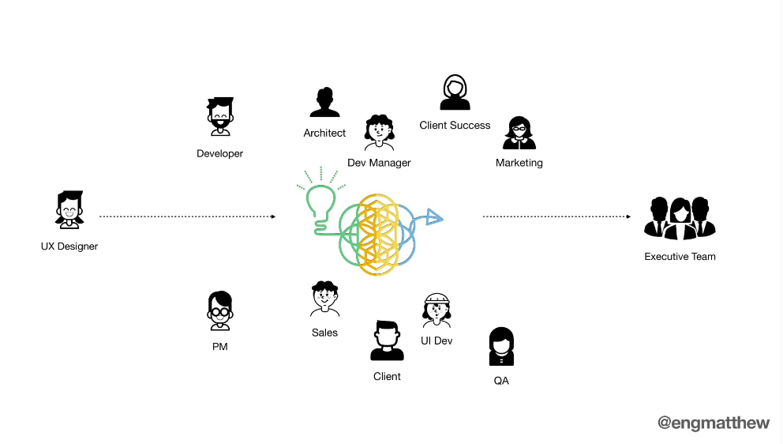
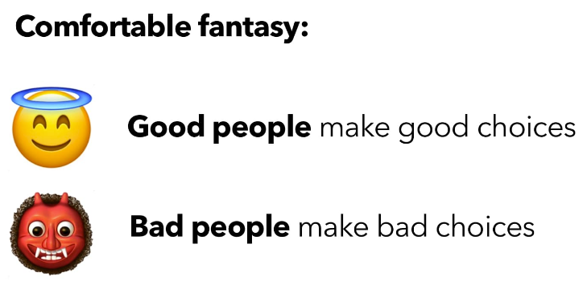
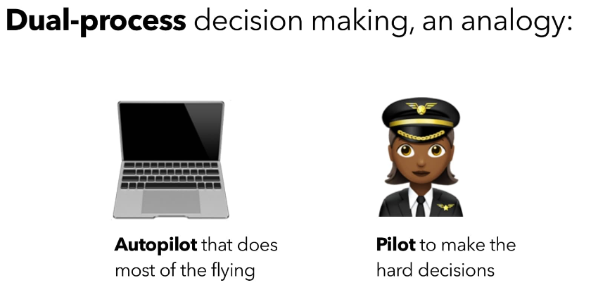

# Chicago Camps: Home Edition

This was my first Chicago Camps event and it was masterfully hosted through the [Demio platform](https://demio.com/). This event attracted some great speakers including [Stephen Anderson](https://twitter.com/stephenanderson) and [Kim Goodwin](https://twitter.com/kimgoodwin). These notes do not cover all of the speakers in the conference.

This writeup will cover the following topics from the event.
[[toc]]

## Unprecedented Complexity
We are in an unprecedented time of complexity. Simple things we once took for granted are now hard, such as using simple tools like card decks. The [Cynefin framework](https://en.wikipedia.org/wiki/Cynefin_framework) can be used to help us understand the types of problems we are trying to solve. These complexities have always existed, we just have new ones we didn’t think of before.

> Some projects we tackle are pretty obvious, e.g. designing a landing page. The objective is easy to define. Examples and patterns and best practices abound. We’ve been there, done that, not much new’ to explore there.
>
> On the Other end Of the spectrum are complex problem spaces or “wicked problems” that escape definition, and for which we must invent new ways of thinking and working. so… think about UX processes. Double diamonds. Lean U X. Agile U X. Design Sprints. Jobs TO Be Done framework. etc. Every month someone’s selling a new ‘way to do UX’ that is presented as the One Process TO Rule Them All.
>
> But is that the right way to think about UX process? Might we do better to 1) define the level of complexity of the project we’re tackling, and 2) choose a UX process/methodology well suited to that level Of complexity?
>
> *Unknown*

## Balance
There is a balance to be struck… These are not problems to be solved, but polarities we must balance. It is easy to stake claim on one of these dimensions without considering the bigger picture, and as a result cause more conflict within your organization.

> * Should we focus on Innovation or Efficiency?
> * Should we prioritize Delivery or Quality?
> * Growth vs. Consolidation?
> * Short-term Gains vs. Long-term Organic Growth?
> * Centralization vs. Decentralization
> * Change vs. Stability?
> * Empathy or Toughness?
> * Keeping Control or Empowering Others?
> * Generalist or Specialist?
> *Stephen Anderson [@stephenanderson](https://twitter.com/stephenanderson)*

## Integrating to Improve Uptake
Design is perceived as slow as a "suggestion". Designers have to defend their ideas and push them through so many people in order to get them into the product.

> No one feels heard...
>
> *Matthew Eng [@engmatthew](https://twitter.com/engmatthew)*

> All of the people involved in your design decisions need to be considered. Developers, Architects, Sales, Execs, and more are all part of the process.

To work effectively together you have to understand your team. Who are the people who influence your project? Map them out.

Build a RACI of the work that people see we have to do. Map where you are on this map. Use this to level set expectations.

> Courage comes into play when you make someone feel heard on issues (where) the disagreement or anger might be.
> 
> *Chris Voss*

Seek to understand, forget about getting to yes, and work towards “that’s right”.

1. Schedule the meeting. Pay attention and keep the camera on.
1. Mirror their behavior.
1. Label “You feel overwhelmed because of all of the feedback from different directions” -> “It’s really not that bad”
1. Connect with that concern and “How can we help you with focusing all of the feedback?”

## Decisions that Harm

We often think of some decisions as ones that are outside of our control. We would have made a different decision right?

Our own methods reveal that we are not blameless in poor design decisions. 

We are imperfect and easily influenced by systems. Those system flaws shape the way we make decisions and we end up making bad ones. These decisions, whoever makes them, are design decisions and nobody cares who was involved if they are bad.

Claim the UX Designer title and own the full breadth of the experience. What information is OK to collect? What uses of data are OK? What is a fair exchange of value? We can help everyone make human-centered decisions. How?

External information should include norms. We think less critically about norms (e.g. chat bots). Internal information is harder to recognize, evaluate, share, or influence, and plays a key role in the decision-making process.

Where is my experience limited or biased? Where am I making assumptions? Where are my stakeholders making assumptions?

*Change is often seen as a loss.* Understanding people’s state of mind can help to change their position. 

> **Denial:** “We don’t have a problem.” – Highlight dissatisfaction, look for teachable moments
> 
> **Anger:** “You don’t know enough to say that.” – Focus on conveying respect(remember, this person is feeling a loss)
> 
> **Bargaining:** “We can make this easier choice instead.” – Be clear that it won’t fix the problem. Sometimes it can be a yes-and. Sometimes people get stuck there.
>
> *Kim Goodwin [@kimgoodwin](https://twitter.com/kimgoodwin)*

**Belief** is what we think _is true_ and **Value** is what we think _should be true_. Changing beliefs takes a long time and is hard work. Appeal to the values, if strongly held, can get people to do the right thing. 

> When [values are] inconsistently followed, point it out (if safe); challenge perceived barriers.
> 
> *Kim Goodwin [@kimgoodwin](https://twitter.com/kimgoodwin)*

Help people internalize the value for themselves and interpret how to apply them for broader organizational impact. Get to know the people around you. 

> Autopilot for most things and Pilot for the complex. Autopilot is the “old mind” and operates without thought like turning a key.

First impressions, things that stand out, confirm beliefs, and last impressions are all emphasized by this “old mind”. The conclusions aren’t rational and fall prey to a whole host of biases. The Pilot needs to override these shortcuts to conclusions. 

![The graphic shows "Accounting for shortcuts" There are three separate columns. In the first column with an emoji pondering smiley, "Beware of doing too much early interview analysis, use structured analysis methods, listen to intuition but don't trust it." In column two with an emoji of two wrestlers, "Learn what beliefs you may need to debunk, repeat important things often over time, emphasize key info by limiting content shared, making it memorable, and choose a messenger." In the final column with an emoji cog at the top, "develop templates for structured job descriptions, interviews, and develop tools and training for good data analysis & decision processes"](./chicagocamps_harm3.png)

What things can impact our ability to override the old mind?

Results get fed back into external information and hopefully change our beliefs. Take a systematic approach starting with Human Centered Values with Enforceable Ethical Standards (there is a whole talk on top of this). 

