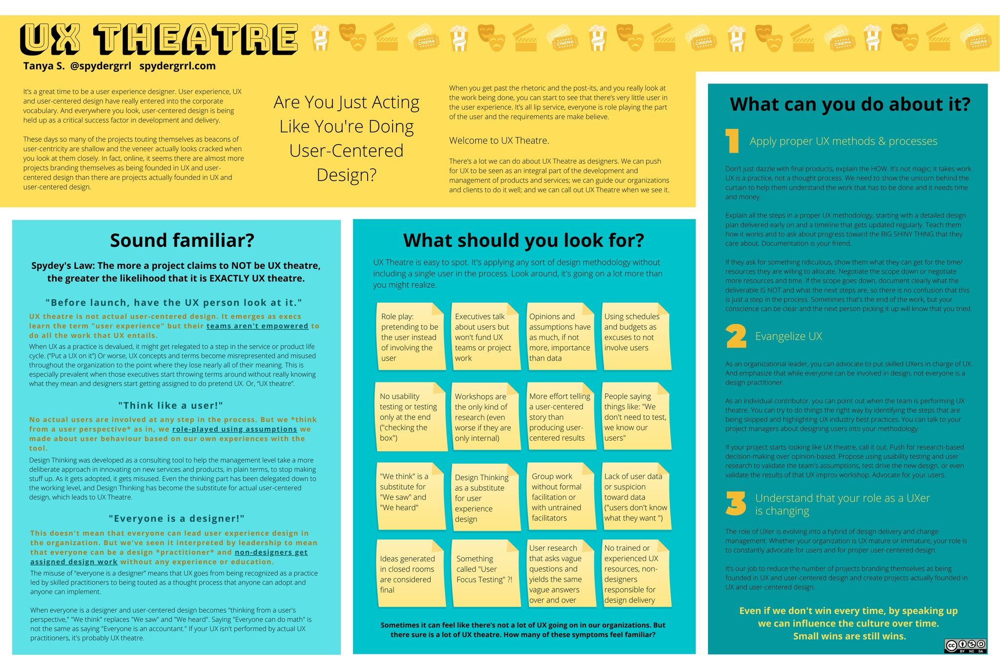

---
title: "What's Happening, June 2021"
description: SOME DESCRIPTION
type: article
date: "2021-06-04"
---

# What's Happening, June 2021

June has been interesting personally. I feel like a wave of relaxation has come over me at work as I prepare to enter parental leave. I'm looking forward to get some focused time with the kiddos. I will return to the office in August, hopefully to a new position.

Professionally, I continue to have an obsession with multi-layered design. For me, this is a meta design challenge where you need to think two layers deep. In a corporation these capabilities can be accelerators for the organization and enable broad impact. Making things that developers utilize (to speed them up) and deliver a good experiences. Throughout my years I have learned a lot about the types of users who use scientific software as well as how developers deliver that software. I hope to be able to find opportunities to continue to explore these types of problems. 

## Learn

### Architecture
I have been reading and watching Pluralsight videos about Architecture including TOGAF 9.2. It is interesting how once you start to dig into some of these things just how much overlap there is with design. Key decisions in this space strongly impact the design and capabilities. 

### UX Theater
I read this article from Jesse James Garrett. It came to my attention through my Twitter feed first. [@vcastillo630
](https://twitter.com/vcastillo630/status/1400498030713913356?s=01), [@cydharrell
](https://twitter.com/cydharrell/status/1400511488285020163), ..., and ... all had strong responses to the article which I read first. As my daughter slipped off into dream-land I put on some binaural audio in my headphones and read the article. 

> [I helped pioneer UX design. What I see today disturbs me: Where did we go wrong?](https://www.fastcompany.com/90642462/i-helped-pioneer-ux-design-what-i-see-today-horrifies-me )
> We thought we were winning hearts and minds, but we were really setting ourselves up for exploitation, as businesses cherry-picked the bits of UX most compatible with their existing agendas and eschewed the parts that might lead to uncomfortable questions that could influence more than the color of a button on a screen.

This is the paragraph that resonated most with me. I have definitely felt this way on various projects I have worked on, but I have also experienced a tastes here-and-there from the other side. Some of my biggest uphill battles to ensure we weren't just UX Theater were eventually won over the span of years with managerial changes, playing across different organizations, and being more direct with the decision-makers.

I have only had the courage to do this because of our focus on personal finances with a strong underlayment of the privelege that having a good-paying job as a white cis male. Without these things propping me up I would certainly have succombed to the UX Theater.

Tanya Snook popularized the concpet of [UX Theater](https://www.spydergrrl.com/2020/05/ux-theatre-poster.html) back in 2018. When the article was initially published she was not credited, but after raising the issue her attribution was promptly added to the article. 

The conflict between lean speed and UX. 
