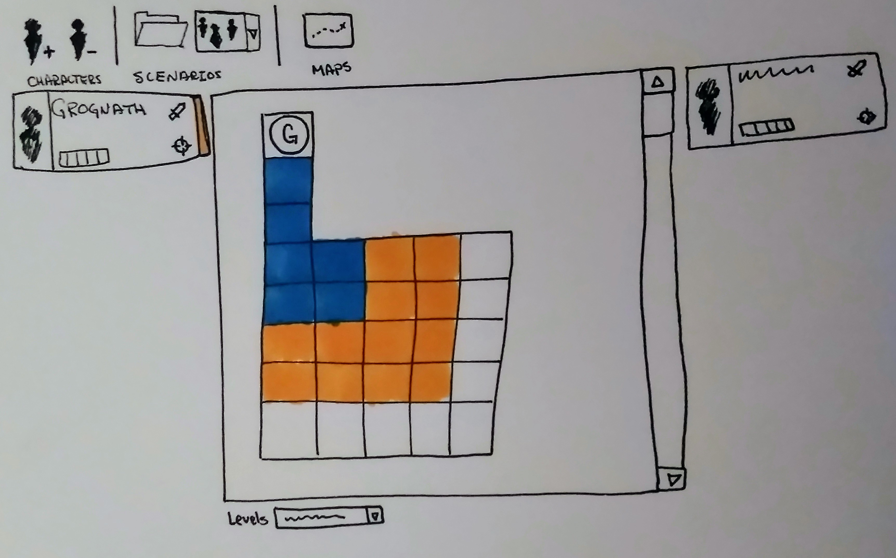

Today, I'm crossing over a major milestone. I suppose this makes me an adult. The average age of retirement is over sixty years old, which means that I still have all of the life I have lived before I even retire. This is great news because I have plenty of time to grow and explore!

My family invested in a bunch of gifts for me this year, many of which are going to help me improve my design practice.

These two packages of Copic markers are now mine, ALL MINE! As my friends know, these are my favorite markers, but I never feel like I can buy them for myself. These new tools will bring new life to my traditional black and white sketches. In addition, the primary colors will make my paper prototypes so much more visually appealing.

To start out with these new tools, I took some time to play. I knew that blending grays would be important for me to be able to really work shadows in my sketches. Here are a few pictures I sketched with the gray set.

\[gallery ids="791,795,796,797,798,799" type="rectangular"\]

As you can see, some of my blends are better than others. The two caricatures are from the movie "Central Intelligence".

In addition, I wanted to try my hand at using some of the colors for an application sketch. I have been slowly building an application to use for playing Pathfinder with my friends virtually. Here is a sketch of how I'm imagining the main application will look.

\[caption id="attachment\_794" align="aligncenter" width="3447"\] Quick sketch with some color that represents the tabletop gaming app I'm building. The colors surrounding the "G" token show how far the character can move. In this case, Grognath is very slow. In this sketch, I'm imagining that the left vertical list will contain player characters and the right list will contain enemies of the party.\[/caption\]

Thank you to my family, if you are reading this. :)
