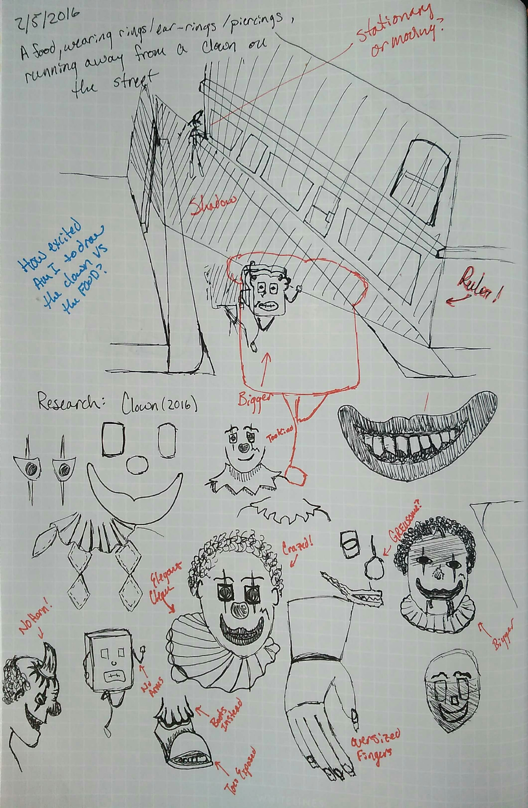
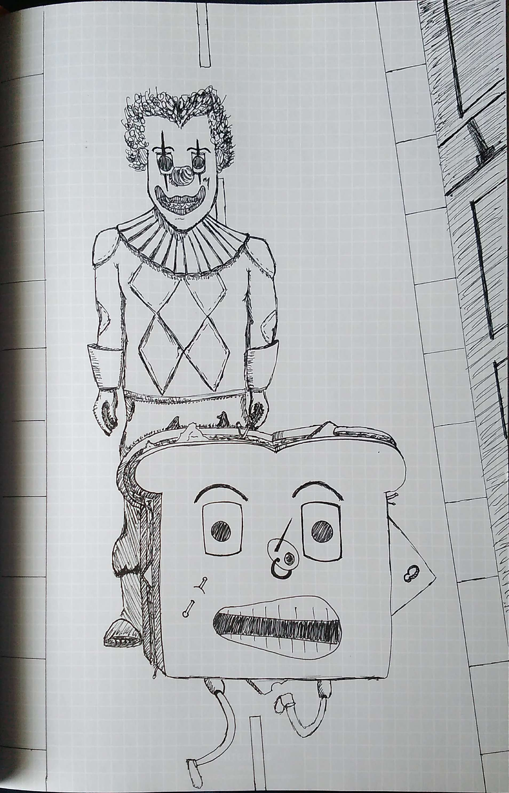

I'm a big fan of the [What to Draw](https://play.google.com/store/apps/details?id=llamaze.com.br.whattodraw&hl=en) app on Android, which gives random sketch prompts. This one stood out to me as being something that would be fun.

> A food, wearing rings/ear-rings/piercings, running away from a clown on the street.

Clearly, this called for some field research. I decided to watch the movie Clown, a horror film in which a man wants to make his son's dreams come true by being the clown for his birthday. Little did he know, the suit would never come off and, predictably, his thirst for the blood of children would be hard to quench.

There were some elements of the movie that I initially thought would be neat in the drawing but turned out to be kind of distracting in my initial sketches. The movie had the clown with a huge horn on the top of his head later in the transformation. I'm not sure if I'm just bad at drawing it, but I decided pretty quickly that it wasn't going to work. This highlights one of the best parts of sketching: **you can always, and easily, change directions.** 

Below is a page of initial sketches I drew while watching the movie. I'm not sure why, but I decided instantly that the "food" would be a sandwich.

I decided that both the clown and the food needed to be large and detailed. I also wanted the food to be running while the clown would appear stationary. This would help give the clown a menacing look. An old-school classic horror film villain, who barely moves yet manages to catch his prey.

Below is the final sketch. I think it didn't come out quite as elaborate as some of my solitary sketches, but I had a lot of fun depicting the two subjects closeup and having the street become more of a backdrop providing a little context. Perspective is something I will have to think more about in future sketches that I can improve.

My final clown may not have looked as crazed as the initial sketches, but I think he looks pretty freaky.

 

Still here? Feel free to comment.
