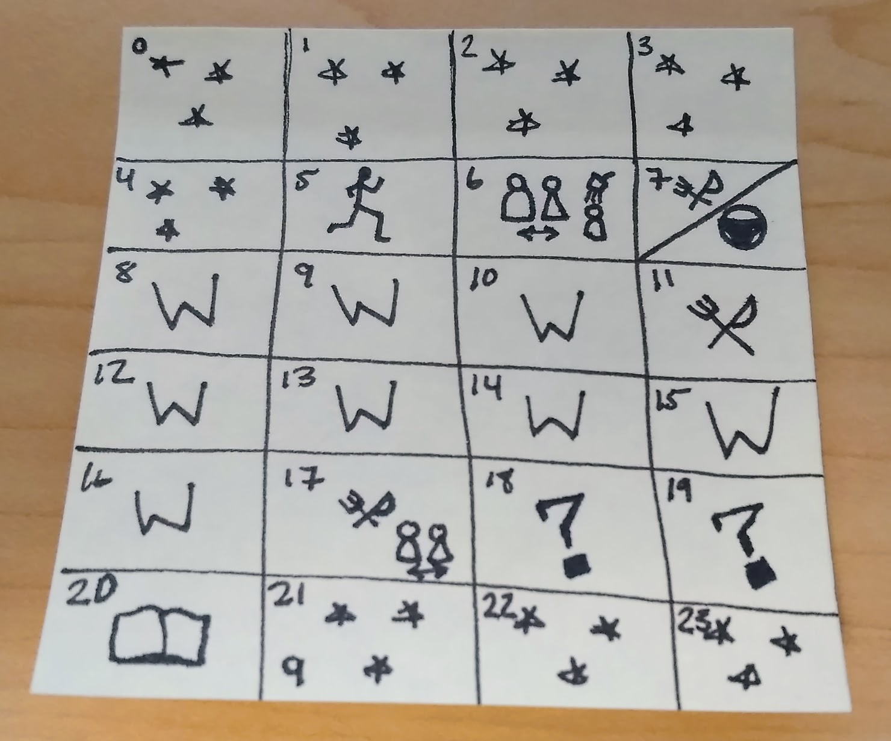

When I feel like I haven't been very productive I think a lot about how retirement would certainly free me up to do "all that stuff" that I wish I could do.

My wife reminds me,

> "If you aren't going to do _that_ with your free time now, you probably aren't suddenly going to do it once you are retired."

This resonates with me, and there are so many little initiatives I have wanted to start over the last few years that I failed to launch, because I felt like I didn't have the time. To solve this problem, I'm following a simple method.

1. Take Inventory of my time.
2. Create a backlog of things to do.
3. Execute.

# 1. Create Time Inventory

It doesn't do you much good to talk about utilizing free time without first making an inventory. I divided a sticky note into twenty-four boxes. Each, of course, representing an hour. This is roughly what I think my day looks like if everything goes according to plan.

\[caption id="attachment\_1091" align="alignnone" width="1480"\] 24 Hours... eating, sleeping, commuting, working, working out, socializing with my family, showering, reading, and "other stuff".\[/caption\]

While this looks like a pretty good plan, I think that things like reading and fitness frequently fall off the plate, so they should probably be listed as "?" as well. With that I should have roughly 4 hours of time that disappears and even other things on the plate like sleep slip into oblivion.

I don't think this problem really gets better with retirement. I think it just creates more opportunities to fall into those same bad habits. This is what I think retirement looks like.

\[caption id="" align="alignnone" width="1820"\] Retirements includes ten hours of miscellaneous as well as an hour where I thought, I could take a nap there.\[/caption\]

# 2\. Create the Backlog

Recently, I attended the Houston UXPA talk by [Ron Vutpakdi](https://twitter.com/vutpakdi) about the [Get Things Done](http://gettingthingsdone.com/) (GTD) method. In that talk, I realized that part of the reason why I don't utilize my free time effectively is that I don't really have an effective catalog of things to do. In addition, I'm sure many of my ideas get lost along the way. Who knows what I might have accomplished five years ago.

I decided to apply GTD towards things I wanted to fit in the buckets. Here is how to get started. From the site, there are 5 steps, which I will list but not replicate here.

1. Capture everything you can think of in a list. (Spend 10 minutes, just doing this, every once in a while.) Keep the list fresh by adding ideas as soon as they come up.
2. Elaborate each of the items in the backlog. For only things that are actionable, include next critical step.
3. Organize the list of actionable steps into relevant lists. (For this exercise, I will keep things for my free time.)
4. Reflect (review) the list regularly so nothing gets lost. In this case, I will continue to do this during my free time.
5. Engage in action!

## My Short List

- Big Design Dallas Abstract
- Brainstorm blog ideas
- Finish desk project
- Clean office space
- Repair Car \[x\]
- Vehicle Inspections \[x\]
- Vehicle Registration \[x\]
- Schedule game night to play that two player dueling game
- Buffer
- Idea for finance calculator
- Tiles and Tokens MVP
- ...

# 3\. Execute

In the time I was writing this article I already crossed off some of my short list. Now all that is left is to do is to follow the GTD method. I'm going to start keeping these free time items in the Todoist app since it is how I already manage the grocery list from Alexa.

...Wish me luck...
