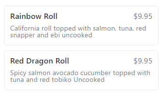

It is interesting how sometimes the smallest things can trigger an emotion. Whether it is a word, a phrase, or even just [learning something new](http://theoatmeal.com/comics/believe). It is important in your design copy to use words relevant for your audience.

Here I am ordering sushi from a local restaurant using a delivery service. Seems like a decent plan, but as I'm reading through the menu I start to realize that the sushi I typically order with a "raw" component says "uncooked".

\[caption id="attachment\_1219" align="aligncenter" width="339"\] The menu text with the word uncooked and Uncooked.\[/caption\]

I start to wonder, do they expect me to cook this somehow once it gets home?

The word raw, to me, means that there is an expectation that I am going to eat it without cooking it. Uncooked implies that cooking is a part of the process.

 

I can't wait to find out what is in this Red Dragon Roll, because I don't know what a "Spicy salmon avocado cucumber" is supposed to be. Do you think that is a plant or an animal? Does it swim in freshwater or saltwater? Is the red tobiko the only thing that is uncooked? This sushi specification could join the [#trescomas](https://en.wikipedia.org/wiki/Silicon_Valley_(TV_series)) copy club.
