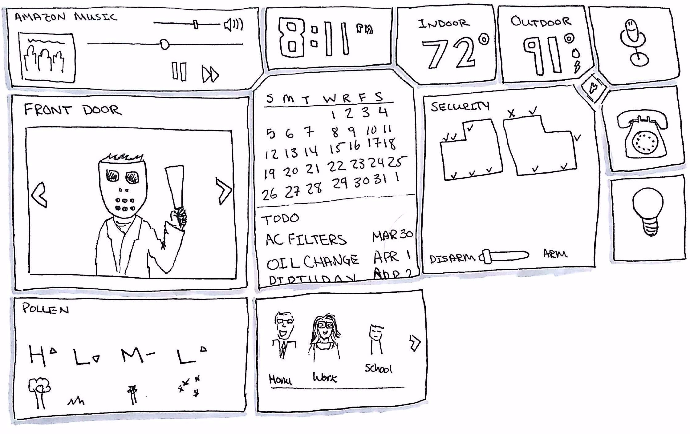
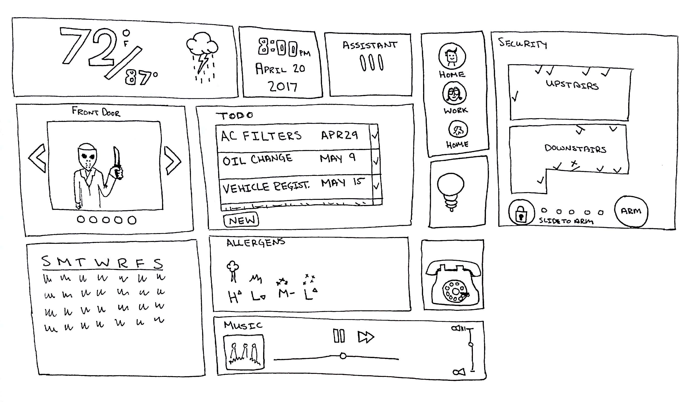

# Sketch A Dashboard
My life would be easier if I had a home dashboard system that allowed me to control different parts of my home and fed me information. Of course, this implies that I have things to control... I do not.

Here are some quick sketches I put together that I will never develop.

The following things came out during my initial brainstorm.

- Time with a calendar and things to do.
- Indoor/Outdoor information including temperature, weather, and pollen counts (because of my allergies).
- Ability to play music from my preferred music service.
- Viewing of any security cameras (of which I have none).
- Voice control for things like Alexa.
- Light control geared towards activities.
- The ability to call people, potentially with video.
- Information about family members, where are they?
- Information about our home security sensors as well as the ability to arm and disarm easily.

My first sketch looks at the whole dashboard as a series of tiles (a common theme for what feels good). One thing I was trying to do was design the dashboard tiles in a way that they are not all squared off, but also not rounded. In my mind, the dashboard would be sci-fi/futuristic blue with a lot of nice lines. Each of the tiles is hovering over a slight gradient background.

My second sketch might be easier for an individual to configure because each tile is rectangular. I could see different companies offering modules that people add to the screen like widgets. The tiles would be semi-transparent, and allow you to set a background image.

