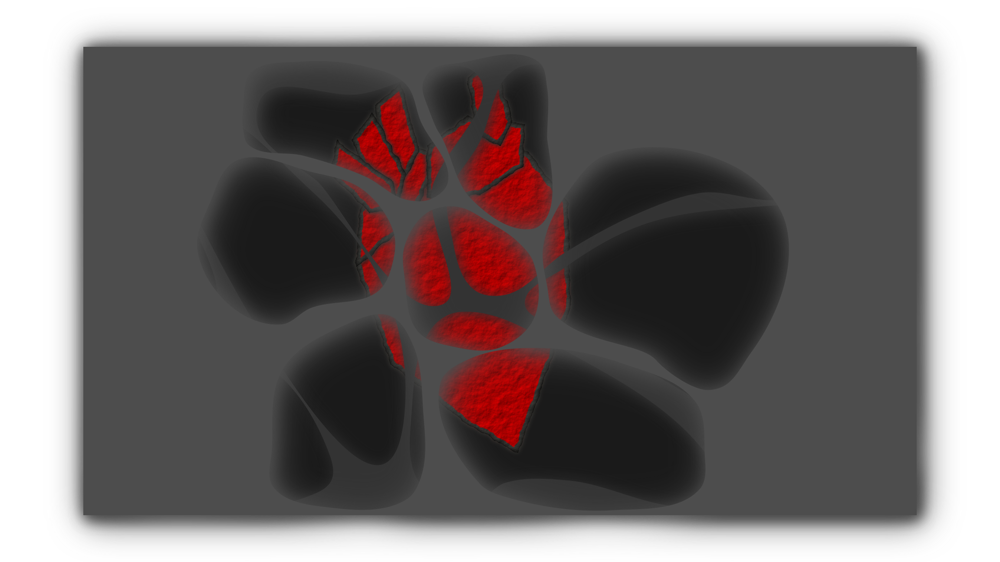
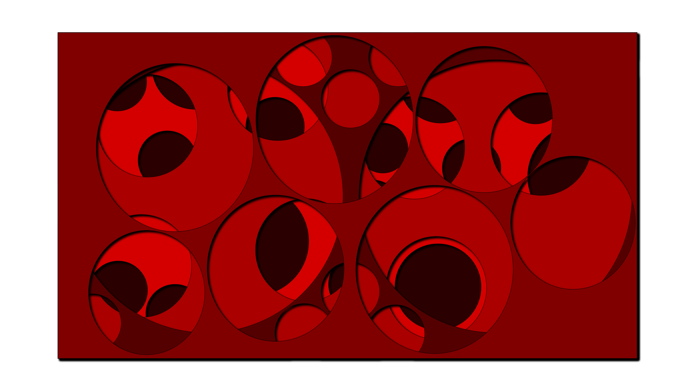

I am back at it again with Inkscape. I have regularly sketched these interesting layered art concepts where it looks like each layer has been cut away to reveal more depth. Below are just a few I had on hand.

\[gallery ids="1723,1724,1725" type="slideshow"\]

I used Inkscape to make a new one that reveals a paper heart. I created several layers of increasing darkness as they go down to help provide some depth. For each layer, I drew paths and smoothed the curve to make a nice cutout. I then added some drop shadow to each of the layers to give it a little more depth.

To accomplish this, I filled the layer with a rectangle the size of the canvas (we call this the plane). Then I drew shapes using the bezier. I then selected the points and used the smooth option to make them nice and smooth. Then I selected the plane and the shape together and used the Path > Difference (ctrl -) to cut the shape out of the plane.

The heart I drew using the bezier curve with an outline of each shape stacked on top of each other. Then, I filled with red and used a paper filter to give it some texture. The shape of the heart is a split between realistic and metaphorical with the twin peaks at the top and the point at the bottom.

 

\[caption id="attachment\_1728" align="alignnone" width="2304"\] Layers of depth down to the heart. See through me.\[/caption\]

 

In this one, I experimented with just circle cutouts, but with more layers. I did them all independently and then rearranged the stacking and changed the colors.

 

\[caption id="attachment\_media-18" align="alignnone" width="2304"\] Clean lines and an array of colors. This one makes me wonder how deep it goes.\[/caption\]

Overall, this technique was pretty simple to do in Inkscape. Once I got used to the keyboard shortcuts things got a lot quicker.
