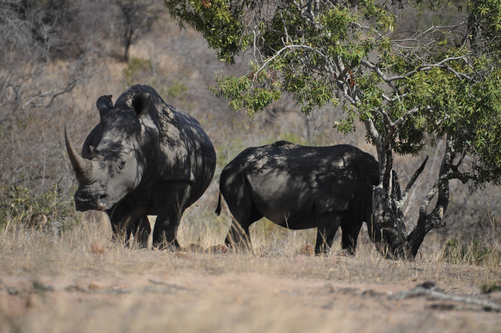
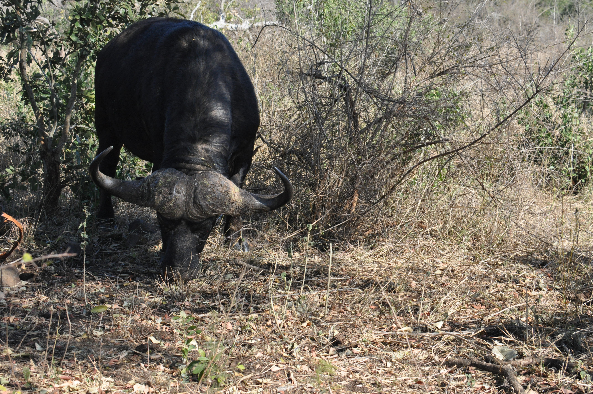
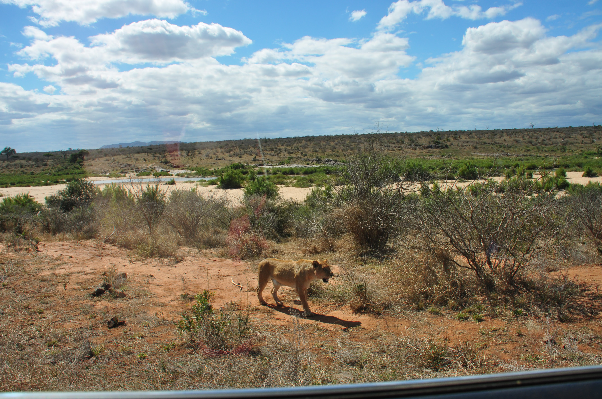
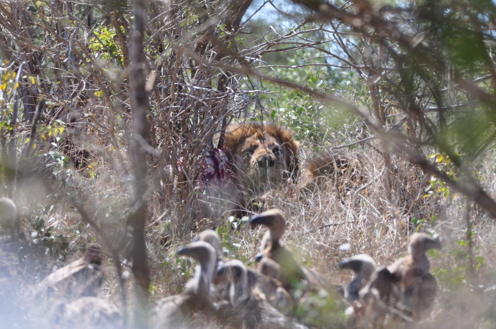

The climax of our trip was in Kruger National Park. For those who don't know, Africa has "[The Big Five](https://en.wikipedia.org/wiki/Big_five_game)" game. We were lucky enough to see them all, but we didn't capture great photos of the Black Rhinoceros. During this part of the trip, we rented a vehicle. It was particularly interesting because they drive on the "wrong side" of the road.

- African elephant
- Black rhinoceros
- Cape buffalo
- African lion
- African leopard

We will start off with the African Elephant. The elephants are easy to identify because the African Elephant's ears are shaped like Africa. We read guides for doing a self-safari in Kruger they mentioned that it is important to drive slowly. Driving faster than 15mph and you will miss things even as large as elephants. We found this to be true as occasionally when we felt rushed to get to our destination we looked in our rear-view mirror and saw elephants crossing the road we didn't see.

We didn't get good photos of the black rhinos, but here are some beautiful white rhinos to substitute them. 

The Cape Buffalo can be identified by its signature horns. We mostly saw these guys grazing around in the bushes. They were very easy to miss. 

We found the lions to be particularly fascinating and tricky to find. We were watching some lions off in the distance through binoculars and through a super telephoto lens when all of a sudden we found ourselves needing to rapidly roll up our vehicle's windows as this beautiful lion approached the car. Afterwards, an entire pride of lions including nearly a dozen cubs approached the watering hole and had a day at the beach. 

We were glad to have the opportunity to see a male lion chowing down on breakfast. This photo, captured through the trees doesn't do the size and scale of this creature justice. I'm not sure I could hug the head of this lion even with my arm-span. 

On our last day in Kruger we were very worried we wouldn't get to see the final of the big five, the African leopard. Just when we were ready to give up and leave for home we saw a crowd of vehicles just off the main road. We angled for positioning with the other cars and managed to snap a few shots of the leopard. 
