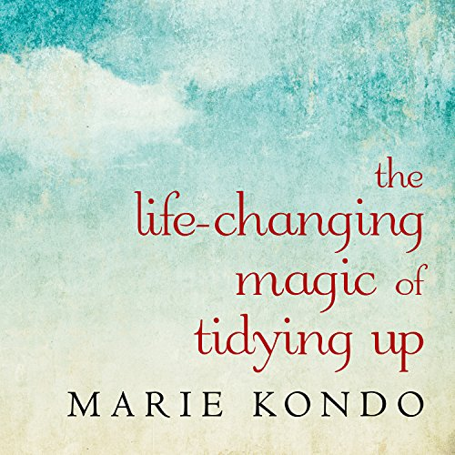

# Stop Hoarders
 

 

I read (listened to) Marie Kondo's [the life-changing magic of tidying up](https://www.audible.com/pd/Self-Development/The-Life-Changing-Magic-of-Tidying-Up-Audiobook/B00RC3M6OG). Marie Kondo's philosophy can be summed up in two bullets.

1. Get rid of anything that doesn't spark joy.
2. Organize and take good care of the rest.

This book made me think about my home and possessions, but it also got me thinking about products we design.

 

\[caption id="" align="alignright" width="262"\] [Title art for the Audible Version of "The life-changing magic of tidying up." by Marie Kondo.](https://www.audible.com/pd/Self-Development/The-Life-Changing-Magic-of-Tidying-Up-Audiobook/B00RC3M6OG)\[/caption\]

We should be giving this much attention to our products. People love coming up with ideas, and without a proper filter, like the joy that Marie Kondo mentions in her book, these ideas end up in our products.

 

It starts out benign enough. It's just one more widget or input to a dialog. Then it grows into a new dialog. Soon we have whole menu systems with complicated information architectures to groom and manage. Eventually, the application becomes so crowded that not even the primary workflows are easy to use.

Tidying up becomes a difficult task. "You can't remove that feature," they say, "people use it!"

We can even use some of the tips that Marie Kondo provides in her book to help us get through the task. Her tips are in bold followed by my commentary.

1. **Sort by category, not location.** Don't go around searching for features to purge, pick up a feature, investigate, and decide.
2. **Tidy in one go. Don't draw it out.** Perform a clean sweep of the things that need to go all at one time. Pull the trigger, push the delete key, get it out of here.
3. **Pick up each item one at a time and ask yourself, "Does it spark joy?"** Is this being used often enough to justify the cost to keep it? Is there a cheaper/better solution to this problem that we have already?
4. **Don't repurpose clothes to loungewear.** Now is not the time to redesign chopped features.
5. **Recycle your papers.** If you have duplicate features, pick one and toss the rest.
6. **Don't keep gifts out of guilt.** Just because someone made, it doesn't mean you should keep it.
7. **Storage experts are hoarders.** Keep it simple, don't try to find new ways to expose your features.
8. **Start with what you know will be easy to get rid of.** Don't start with the expensive features that get the most support calls first.

After you have purged your application of all of the old pumpkins, fire-hazard newspapers, and old tchotchkes start redesigning how the remaining features integrate together (organize).

It is important that after completing this activity that the team ensures that we aren't going to be back in the same place six months, 12 months, or 5 years down the road. The team needs to say "no" more often than they used to. In Jared's talk titled "Building a winning UX Strategy Using the Kano Model, he says, "It turns out that the most important thing that a team can do to help their design is to say, “no” to almost any idea for a feature." The products with the best experiences have teams that say "no". "Curation is the trick", Jared says. [Building a Winning UX Strategy Using the Kano Model - Jared Spool, at USI with notes by Mike Neff](https://medium.com/follow-along/annotations-on-building-a-winning-ux-strategy-using-the-kano-model-jared-spool-at-usi-958da363ec4d).
