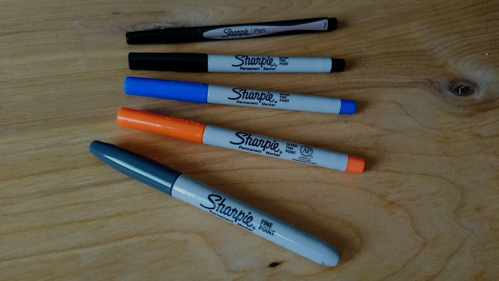
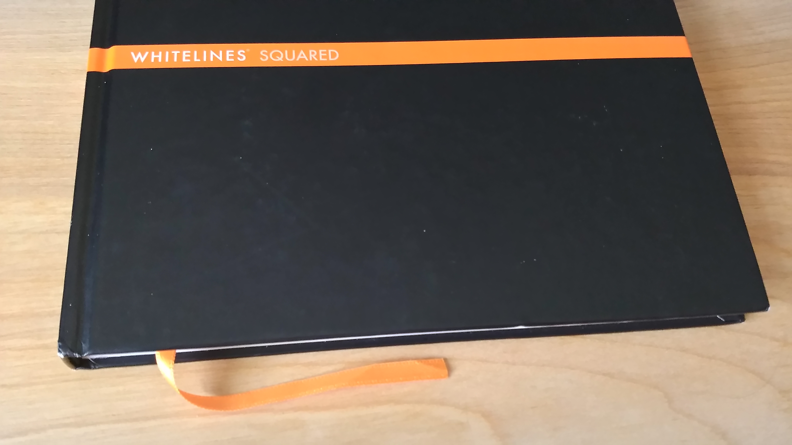

Sketching is one of the best tools for rapid communication and iteration. It is a skill that improves with practice, and in 2017 I'm practicing more than ever. Today, I'm sharing some of the tools I use for practice and some of the sketches I have made so far this year.

# Tools

Here are some of my tools for practice from top to bottom. You'll notice they're all Sharpie brand. Sharpies are great pens for practicing sketching. They are fairly inexpensive but produce quality sketches. 

1. Sharpie Fine Black Pen - For all of my sketches
2. Sharpie Ultra Fine Black - For bolder lines and writing
3. Sharpie Ultra Fine Blue - For indicating "clickable" objects in my UI sketches.
4. Sharpie Ultra Fine Orange - For annotations
5. Sharpie Fine Gray - For shadows

I'm currently storing my sketches in this Whitelines Squared notebook. The grids are pretty subtle, and are typically not distracting. Here is what it looks like from my phone. The lines are supposed to disappear when scanned as well.

\[caption id="attachment\_77" align="aligncenter" width="197"\] Random Shapes\[/caption\]

# Areas for Improvement

For my work, I want to continue improving my ability to explain complex concepts through sketches. I'm focusing on the following three skills:

1. Diagramming
2. Illustrating
3. Speed

# So far in 2017...

Sometimes I don't always have a good reason to sketch, and for that I'm looking externally. Below are some sketches that started from the Reddit [r/SketchDaily](https://www.reddit.com/r/SketchDaily/) group. Every day, there is a new prompt, and usually an alternate prompt. For example, Spring, Cyborg, and Evil. I don't typically color these sketches, but I did decide to color the cyborg.

\[gallery ids="28,29,30,63" type="columns"\]

Here are some miscellaneous sketches that made it into the mix.

\[gallery ids="70,68,67,66,65,62,64,79,78,69" type="rectangular"\]

 

_Thoughtfully Edited by Patricia Lowry_
