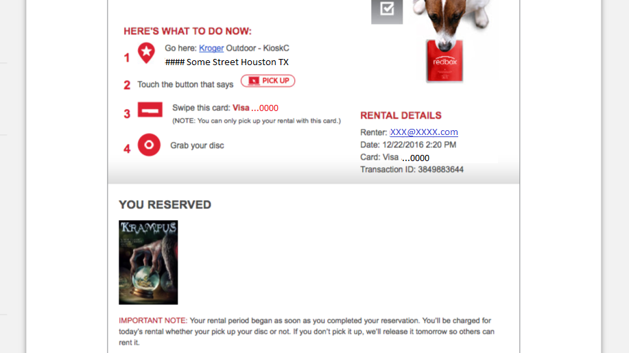
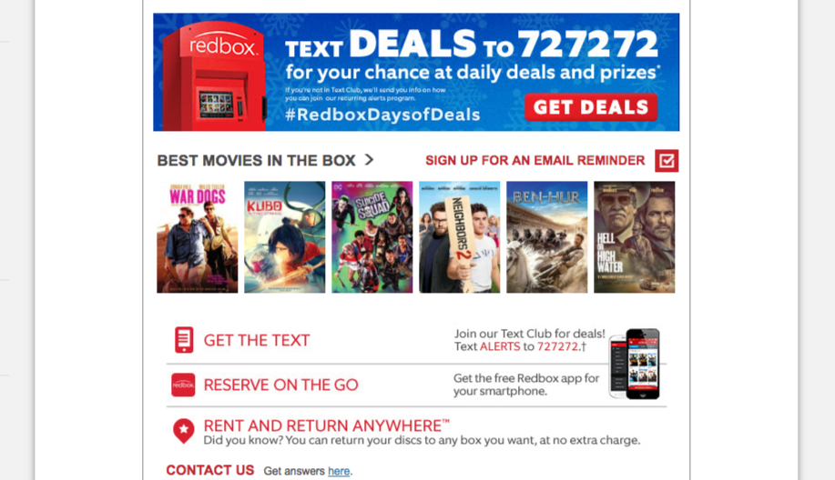
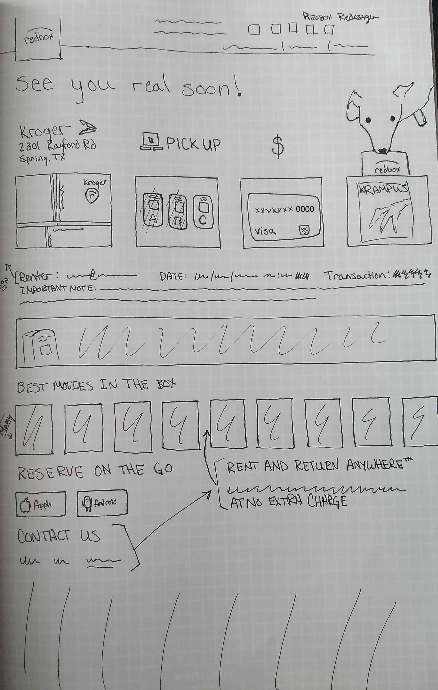
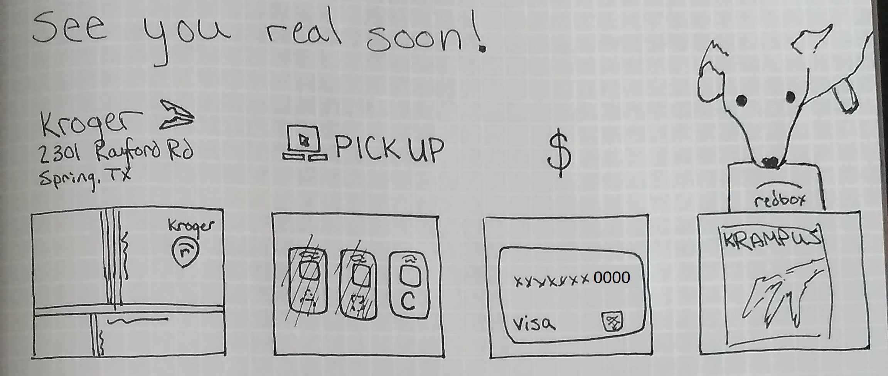
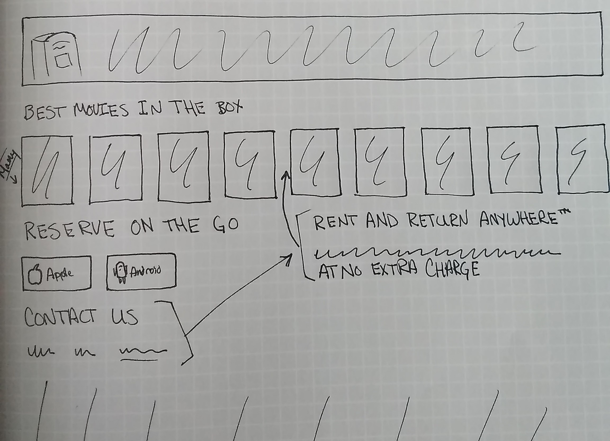

I have the "Design Bug," which is a clinical way of saying that I find myself wondering how I could improve experiences that I have. Redesigning things is fun and relaxing, and can also be a good way to demonstrate design process.

_Formatting note: Over the first few Unsolicited Redesigns, I will be working on the form and function of these posts. Please feel free to send your feedback._

# The User Problem

\[caption id="attachment\_387" align="alignnone" width="863"\] The Redbox email, before scrolling. ([See Full Email](https://joshualowrycom.files.wordpress.com/2017/03/2017-02-04-15-52-inbox-google-com.png))\[/caption\]

 

I ordered Krampus to watch with my wife just before Christmas. I don't regularly use Redbox, but we were in the mood for a Christmas movie and the kiosk is right next to our local grocery store. We could get the movie with our groceries and return it the next day. Easy, right?

I took a quick glance at the email and confirmed the following things:

1. The Redbox kiosk is at the correct grocery store.
2. It is outdoors.

Upon arrival, I saw three machines, and instantly I thought _Hmm maybe it doesn't matter which one I use._ I pushed the logical buttons on the screen and inserted my card. Fail. A message popped up saying my movie wasn't there-no other details. I tried another machine, the same message. I finally noticed the last machine was labeled "Kiosk C": BINGO!

I didn't notice any of the content or options below the initial screen until I started doing this analysis.

# Decomposing the Email

I would classify this email as having two parts. Part one is all of the information that I need to get the rental that I purchased. Part two is for marketing and engagement. This is where Redbox is trying to drive repeat business from me right before I'm about to pick up something I have already purchased.

\[caption id="attachment\_405" align="alignnone" width="917"\] The most important component of this email is where my rental is housed. I completely missed the KioskC, which appears here as a single word as an afterthought on the location. This feels like a holdover from the days when there may have only been one machine. If I can get this information, I can get my movie from the machine!\[/caption\]

\[caption id="attachment\_406" align="alignnone" width="917"\] Redbox is trying to get many things from me here. Sign up for text messages (three times), download an app, inform me that I can return my rental anywhere, and also tell me about other movies that I could rent.\[/caption\]

# Design

Any good design (or redesign) is intentional and has goals. Below are some goals for improving the design based on my experience.

Here are my goals:

1. Changing the way we represent the four-step process will improve our ability to see where we should go, and what we expect to see there.
2. There are repeated details regarding the order and payment method. Reduce these, as they are unnecessary.
3. Rearrange the marketing and engagement opportunities to emphasize the things Redbox would like the most. Based on what they have, I think it is clear they want you to use their text messaging service.

Here is the full view of the Redbox email sketch as it would be viewed on a desktop/laptop.

\[caption id="attachment\_454" align="alignnone" width="2287"\] I kept the dog in the email because Redbox uses dogs in many of their emails and it is a unique/memorable touch. I removed some of the accompanying graphics because they were getting in the way. _Disclosure: I realized I could do more rearranging after making this sketch. It was super cheap to just redraw it below with less detail._ \[/caption\]

## Goal 1: Improve the four-step process

The most important part of this email is understanding where to get your movie. It is still four steps, but I pulled the kiosk away from the address. This allowed me to create a graphic that would emphasize which kiosk it is and indicate that there would be more than one. The dog now looks like it is retrieving my movie.

## Goal 2: Reduce unnecessary transaction information.

The visa card was one of the duplicated items on the screen. It is more important to show it as part of the four-step process because, without it, you can't pick up your movie. The positioning felt like it broke the flow of the screen, and was causing formatting issues on smaller screens, like my phone... See below how the original looks on my phone and a sketched version of how this design would be laid out on the phone.

\[gallery ids="396,393" type="rectangular"\]

 

## Goal 3: Rearrange Marketing and Engagement

 

I left the highest item that Redbox clearly is trying to emphasize. There could be some workaround redesigning the actual graphics that could make sense. I think rearranging these things to be more compact and removing duplicated items (such as the text option) will result in a cleaner look that may result in a better click-through.

I think emphasizing that there is an iOS and Android version of the app will land better with people. Most businesses with apps appear to be using the official store icons instead of images of phones.

With a little instrumentation, we would easily be able to measure whether these changes have an impact via A/B testing.

_Thoughtfully Edited by Patricia Lowry_
