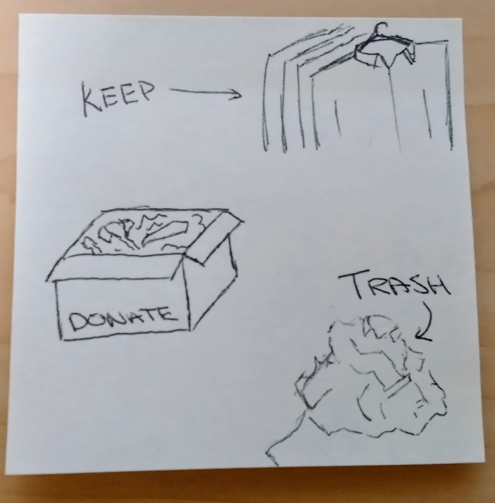
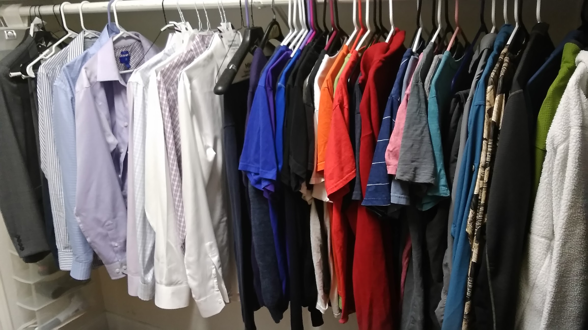

> "You'll see I wear only gray or blue suits," \[Obama\] said. "I'm trying to pare down decisions. I don't want to make decisions about what I’m eating or wearing. Because I have too many other decisions to make."

Why do we have all of these options?

- Blue suit or black suit?
- Black, Gray, or Blue Pants?
- Polo or Button-Up?
- Which color shirt works best?
- Which of these ties goes with the shirt/pant combo?
- ...

The truth is that nobody really notices what you are wearing, but they do notice whether or not you look good in your clothes. To be clear, minimalist doesn't have to mean boring or unvaried but minimized to the necessary garments.

Design your minimalist wardrobe to feel and look your best.

# Evaluate existing wardrobe

Separate your clothes into two piles. Fits and doesn't fit. Donate anything that doesn't fit, because things that don't fit hide your good qualities and make you feel frumpy. _Companies like Men's Wearhouse will give you an in-store voucher for donating things like suits during promotion periods. This can be handy for future steps._ 

****

Start taking notes as you wear the remaining clothes. Ask yourself, "Do I feel confident when I wear this?" If you have someone who will give you honest feedback ask them, "Do I look good wearing this?" If the answers are anything except for a resounding "YES!", donate it.

Work to understand the trends in your remaining outfits. For me, blue and gray pants look good, while black did not. Polos looked bad, nice-fitting button-up shirts looked great. What works for me may not work for you; this is about picking a _personal_ strategy.

# Build & Replace

By now, you may not have enough clothes to make it through the week. Take what you learned about what makes you look and feel great to purchase some new clothes. You don't need much more than a week's worth of clothes. In addition, if you work in an office, you can re-wear clothes a couple of times before they need to be laundered.

Here is what my wardrobe looks like:

1. One gray suit and a few ties
2. Four Blank Label tailored shirts
3. Four tall button-up shirts from Men's Wearhouse
4. Two pairs of dress pants from Men's Wearhouse
5. Three sweaters
6. Two pairs of Jeans from Cavender's
7. Five T-Shirts from Old Navy
8. A smattering of generic t-shirts for things like yard work and painting
9. One stack of blue Gold Toe socks
10. One pair of brown dress shoes
11. One pair of gym shoes
12. One pair of Tom's shoes
13. Fitness clothing
14. Winter clothing

Now that you have fewer clothes overall, you can spend a little bit more money to dial in the fit and feel of your clothes. A tailored shirt from Blank Label will look better than a shirt bought off the shelf from Men's Wearhouse.

As clothes are worn they will wear out. Replace them.

_Thoughtfully edited by Patricia Lowry_
