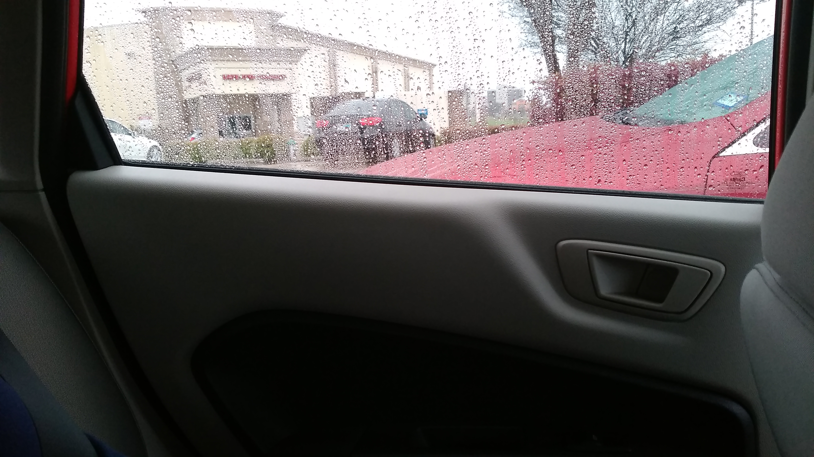
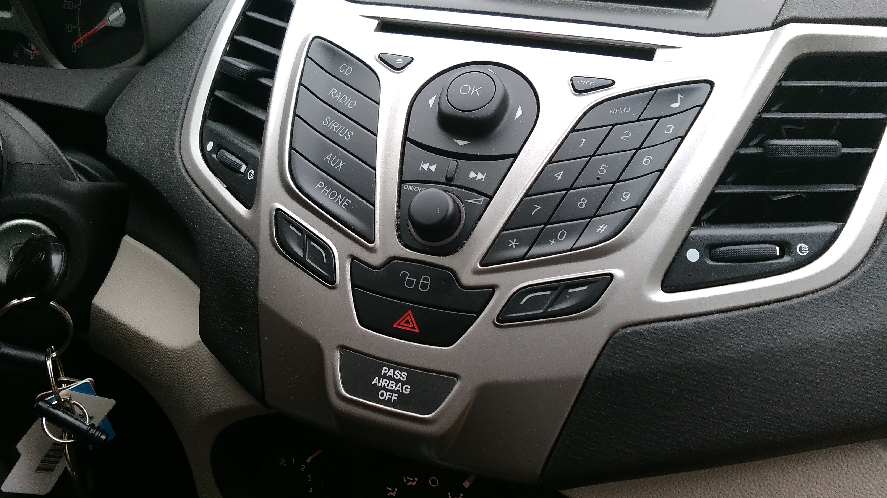
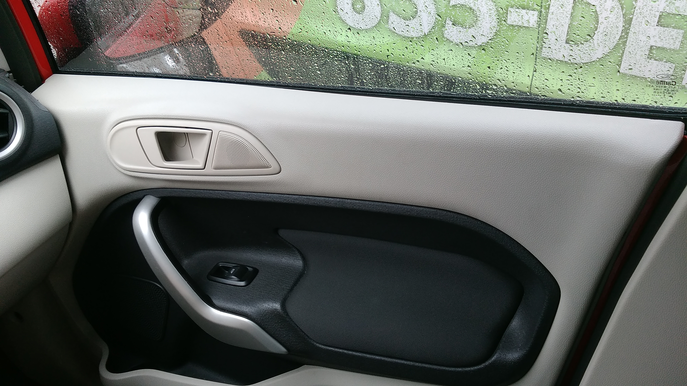

My wife, Patricia, and I went to visit my parents for the weekend a while ago. My stepdad drove us to breakfast in his Ford Fiesta. When we arrived, Patricia tried to get out but realized that the door was somehow locked. Upon further investigation, there may be some interesting design safety considerations about the locking mechanisms on the car doors.

\[caption id="attachment\_828" align="alignnone" width="4096"\] The back door of the car. See how there are no manual locks.\[/caption\]

Typically, you might say, well the back seat is where kids sit. They shouldn't be able to unlock the door. Well that may be true, but what do you do in case of an emergency? One should be able to unlock the door!

The locking mechanism is in the dash. It failed to unlock the backdoor too.

\[caption id="attachment\_826" align="alignnone" width="4096"\] There is the lock/unlock door button just about the emergency flashers.\[/caption\]

Additionally, the back seats aren't the only doors without manual locks. The front passenger-side door is also missing a manual lock mechanism.

\[caption id="attachment\_825" align="alignnone" width="4096"\] Fancy window control, check. Door handle, check. Door lock, nope!\[/caption\]

There is another design consideration that we found interesting that isn't related to safety. There, on the dash, a Sirius button.

\[caption id="attachment\_826" align="alignnone" width="4096"\] CD, RADIO, SIRIUS, AUX, AND PHONE\[/caption\]

Upon investigation, the car has the Sirius button on the dash, but the car is not enabled for Sirius Satellite Radio. A button with a label that actually does nothing.
