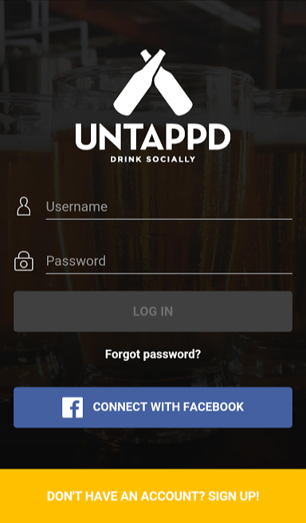
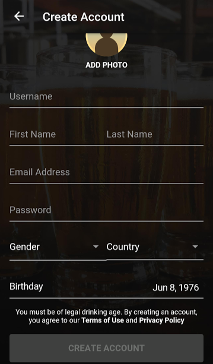

I went to a happy hour with a friend at a local bar called Hops Scholar. I've been to the bar before, and I really like that they have a wide selection of beers (47 taps) and an easy-going atmosphere. They have a chalkboard which typically lists their beers, but this time they told us, "We have our menu on this app, it is called \[pause, while the bartender turns a placard around\] 'Untapped'". We said, "Great!" and ordered a round based on the bartender's initial suggestion and sat down at a table across the room.

We both started installing the application. Well, first we started downloading it really. It took about 5 minutes.

After it was installed we were both eager to see the menu of beers and make a selection, but then this happened:

I don't have the Facebook app installed on my phone, because I find it to be distracting. I also don't know the login, because I use an app for that. Instantly, I find myself in a pickle. Sign up for this app so I can see the menu, or talk with the bartender again about their dozen plus beer selection.

Well, let's see what that registration looks like... maybe it won't ask for much.

Wrong! We gave up and went to talk to the bartender...

Jared Spool has a great story about the $300 million button. You can read about it on the [UIE website](https://articles.uie.com/three_hund_million_button/). I think the article makes one thing clear that hits home in this situation.

> “I’m Not Here To Be In a Relationship” - Jared Spool

If you want my birthday, gender, country, email, as well as my first and last name you are going to have to woo me at least a little bit. In this case, I wouldn't even be making a relationship with the establishment "Hops Scholar", but with this third party company "Untapped".

This is a great situation where we can ask, "what problem are we solving"? We can also ask, "is this the best solution?" What if forcing customers to install an app is the modern-day, brick and mortar, $300 million button?
