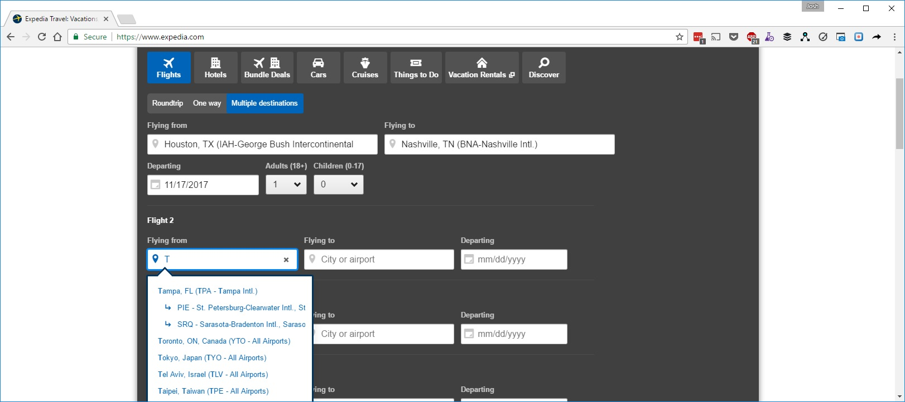
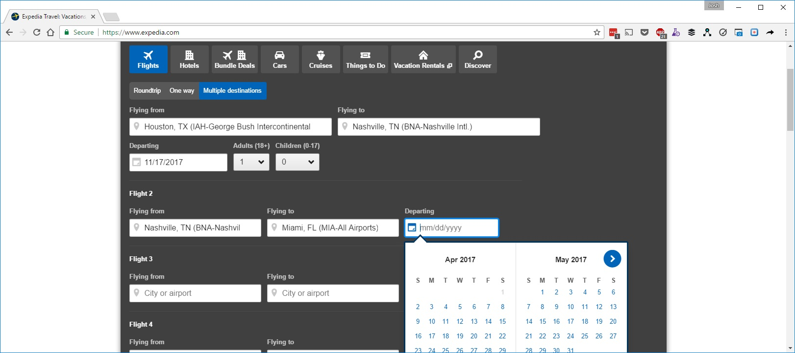
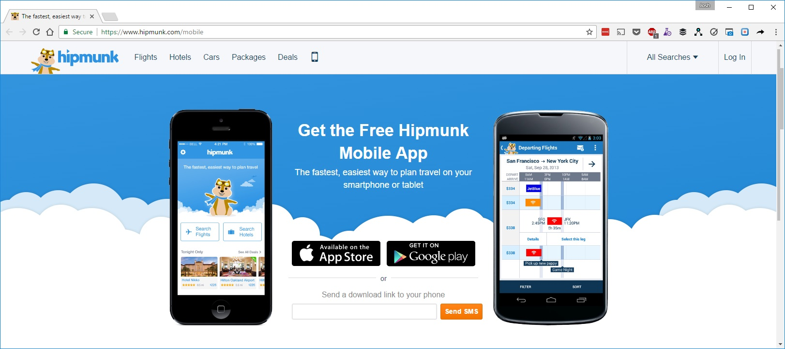

Beginning research is an acknowledgment that we don't know. There are many things that we may not know, and we can try to articulate them by listing hypothesis as assumptions and then testing them with research. We are always better off knowing sooner because our ability to pivot is improved and our sunk cost will be lower.

> Assumption: When a person is booking travel with multiple destinations that the beginning of their next flight could literally be anywhere in the world by default.

> Assumption: When a person is booking travel with multiple destinations that the beginning of their flight could be at any time starting from today into the future.

> Assumption: People will book travel on their phone.

> Every design is filled full of assumptions, test them and advance your design.

The secret is that all of these assumptions can be validated, and you don't have to write a single line of code to find it out. Draw up a series of sketches, evaluate them within your team against your assumptions, test them with someone, iterate until your iterations are about tweaking pixels more than tweaking interactions, and then add it to the development backlog.
