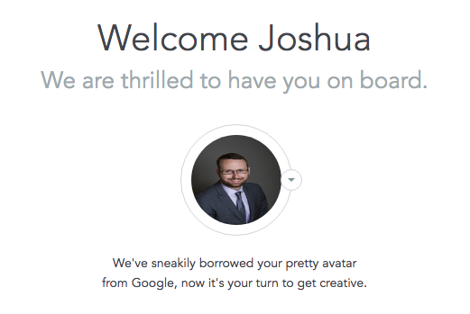

> Sneaky makes me wonder what you are doing with my information!

\[caption id="attachment\_1186" align="aligncenter" width="521"\] Screen displayed after allowing access to my Google account in a signup. _Side note, I think the aspect ratio is off a bit._\[/caption\]

This is an example of trying to be cute and helpful but actually causes me wonder if I made a poor choice to **trust** the application. Acquiring my photo is helpful and most sites do this after registration, but it isn't sneaky.

Thank you for reading this short post. :)
