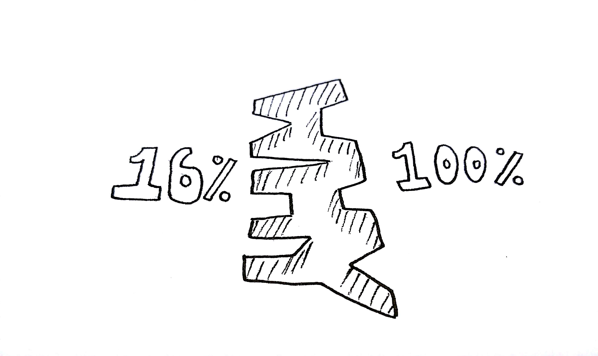
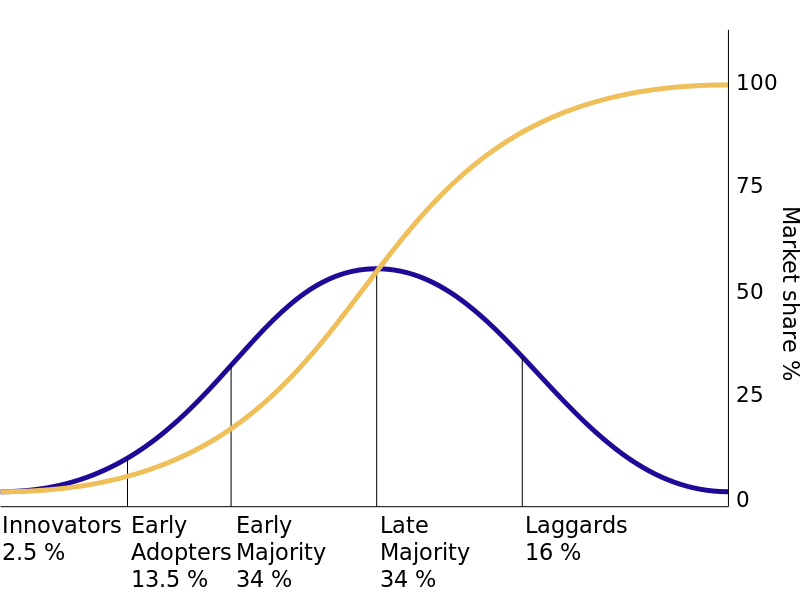

I recently re-watched a great TED talk by Simon Sinek titled "How great leaders inspire action".

There are two things that resonate with me from his talk. He says, "what you do simply serves as the proof of what you believe", and "you can trip over 10%" of users. To get to 100% of your users you need do two things.

1. Figure out why you exist in order to appropriately sell the what and how of what you do, which are derivatives of why (hopefully). Once you have this information, you need to use it to advertise your products and services.
2. In the world of your potential users, communicating why is the beginning of the domino effect of getting the maximum potential users.

https://www.ted.com/talks/simon\_sinek\_how\_great\_leaders\_inspire\_action

# Start With Why

Simon references these concentric circles to explain why the answer to "why" is so important. The how and the what are just the result of the why, and alone, they don't sell people on your product.

\[caption id="attachment\_1634" align="aligncenter" width="295"\] Sourced from: [Start With Why](https://www.startwithwhy.com/tabid/79/default.aspx)\[/caption\]

 

## Apple Pitch

Here is a pitch for Apple from Simon's talk. Sounds pretty usual.

> _We make great computers. They're user friendly, beautifully designed, and easy to use. Want to buy one?_

Yeah, great, you and everyone else is saying the same thing essentially. Let's try this again by leading with the why.

> _With everything we do, we aim to challenge the status quo. We aim to think differently. Our products are user friendly, beautifully designed, and easy to use. We just happen to make great computers. Want to buy one?_

The difference is astonishing to me.

# Cross the Gap

The first 16% of the potential user base is effectively free if you have a good product. Hell, the top 2.5% will probably use the product just so they can say they were first. We know this because many of these people sleep outside of the apple store for the latest gadget even though they could wait a week and get it without the hassle. Simon also talks about the people who were the first to buy in to early versions of the flat screen televisions before the technology was even good. \[See: [Diffusion of Innovation](https://en.wikipedia.org/wiki/Diffusion_of_innovations)\]

To cross "the gap" you need to start by communicating your why. 

 

After you trip over the first 16%, the next 68% will start rolling in only after your innovators and early adopters are raving about how their life has changed after using your product. Those 16%, armed with your why will sell your product to the rest.

The hard truth is, the final 16% are harder to capture. They would still be rocking rotary phones if we hadn't forced them to move to a dial tone phone.

\[caption id="" align="aligncenter" width="800"\] The top 16% are Innovators and Early Adopters. The Early Majority need the Innovators and Early Adopters to try your product first. Sourced from [Wikipedia](https://en.wikipedia.org/wiki/Diffusion_of_innovations#/media/File:Diffusion_of_ideas.svg).\[/caption\]

In the enterprise, management is quick to throw people at your product if they believe it is good. If these people aren't actually the type to be innovators or early adopters, this can cost you later. You really want someone who is interested in trying new things and put up with some growing pains to be your first users!
