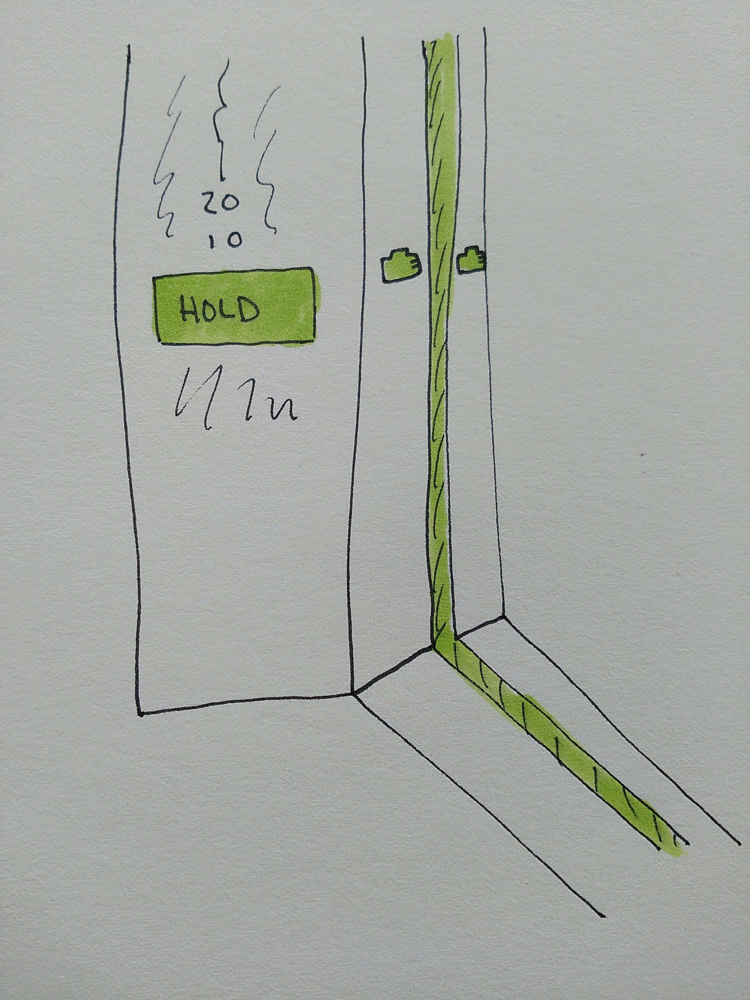

Have you ever approached an elevator and on your way through the open doors you suddenly realize that the person inside wasn't holding the door? What about from the other side? You are using the button to hold the door and the person outside is waiting for you to flag them safely through the doors. These are awkward moments of the poor design of elevators.

Here is my quick design idea to solve this problem.

Make a "Hold" button. The term hold actually represents what you want to do better than the symbols usually do.

What if that hold button triggered a light in a similar color in the gaps of the elevator and also as part of a hand image that would act as a visual indicator that someone is indeed "holding" the door.

