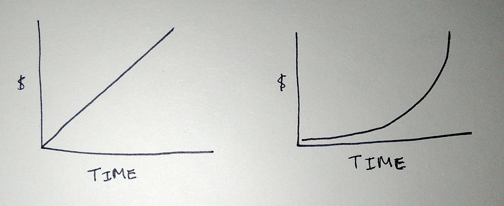
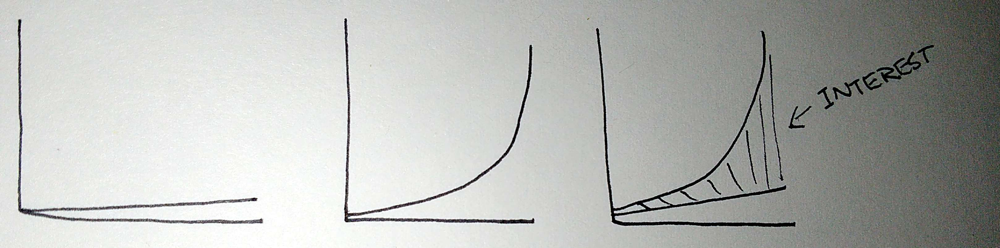
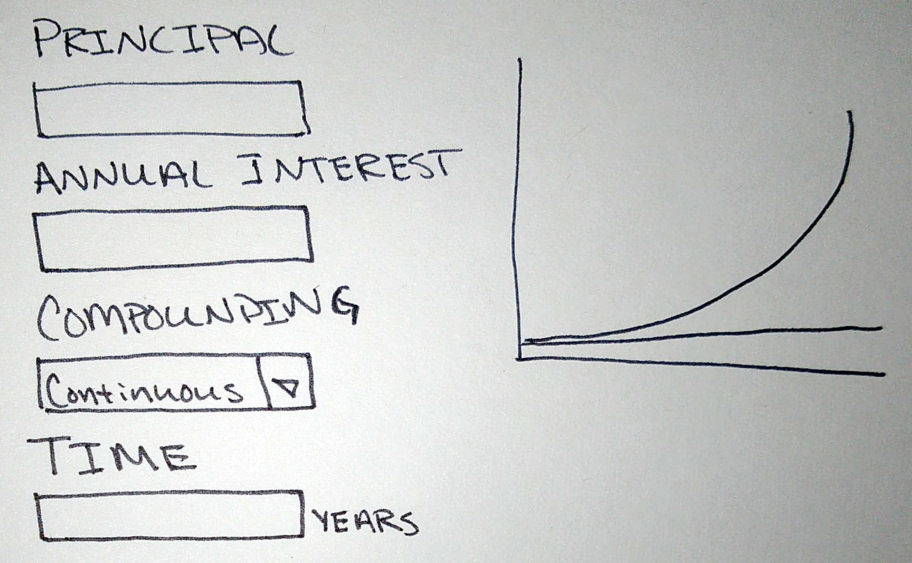

So many people tell me that their sketches aren't good, but they are just overworking it! People assume that a sketch has to be beautiful, with straight, clean lines, and maybe even a little color. They are wrong.

> Sketching is a device for communication. As soon as you have what you need, you can stop!

To demonstrate my point. Let's talk about compound interest. Anytime we sketch data visualizations it can be tempting to put in real numbers. This can be time-consuming and unnecessary for the purpose. See below some simple sketches.

\[caption id="attachment\_1512" align="alignnone" width="2872"\] Left, a representation of what your savings account looks like over time if you don't earn interest. Right, a representation of the compounding interest you earn on the money you put in.\[/caption\]

 

Upon further inspection, it might appear like the result of the left and right plots end at the same dollar values. This does not do a good job at communicating the purpose of the concept.

> What you get out is exponentially more than what you put in.

I have adjusted the axes to have the same range across the plots. This helps show the scale difference between the amount of money saved and how much money you receive back in interest. I also added a combined plot that shows the difference.

 

\[caption id="attachment\_1528" align="alignnone" width="3236"\] Y-axis have the same data range. The right-most representation shows the two lines together.\[/caption\]

 

This isn't significantly more sketching effort than the first sketch. It doesn't contain numbers. It isn't very accurate, but it communicates the point.

Now, I can use the data visualization in a mockup of a quick calculator.

 

\[caption id="attachment\_1546" align="alignnone" width="2456"\] A simple interest calculator.\[/caption\]

 

This sketch can be validated with stakeholders, subject matter experts, and engineering teams. From there, we will learn and iterate.
