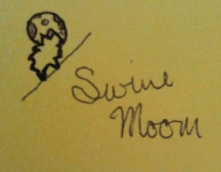

I remembered sketching a cool pig and a moon concept years ago, but I couldn't recall if I had taken a picture of it. I went to my Google photos and started sifting. Then I had the great idea to try searching for the term "Yellow" because I thought it might have been on a yellow sticky note. While I got many great photos with the color yellow, this one was not there. Then, I went out on a limb and tried to search for the term "sketch". I was shocked at how well Google identified my sketches! There it was, near the bottom. This should tell you how long ago this sketch was created. _In fact, Google claims the photo was taken back in September 2011!_

I wanted to see what it might require making it come to life using free tools, so I picked up Inkscape. I never lock myself into a single tool, because there is no single tool to rule them all. If a tool is necessary to get the job done, I will pick it up.

\[caption id="attachment\_1718" align="aligncenter" width="434"\] My basic 1-minute sketch on a sticky note. I would have taken a better picture, but the sticky note is long gone.\[/caption\]

I'm completely new to Inkscape, so I went and watched a quick tutorial on youtube. This particular tutorial gave me a decent command of the application.

https://www.youtube.com/watch?v=8Cl6IF3\_n\_U

About 2 hours later, including learning and some software troubleshooting with xQuarts on my Mac, I was able to create this little guy.

 

\[caption id="attachment\_1675" align="aligncenter" width="195"\] The swine and the moon basking in a light background.\[/caption\]

\[caption id="attachment\_1693" align="aligncenter" width="225"\] The swine and the moon chilling out with a dark background.\[/caption\]

 

Inkscape has a few quirks on the Mac that makes it a bit frustrating. One is that Inkscape is clearly made on a Microsoft Windows standard so keyboard shortcuts tend to use "control" instead of "command". This leads to some confusing copying and pasting between apps if necessary. Another is that it requires xQuartz. While not that big of a deal, I do prefer to run applications without a bunch of extra additional bloat. Overall, I think the application fills a purpose and will satisfy my basic desires for a fraction of the cost of Adobe products.
