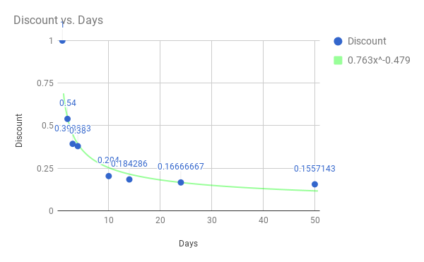
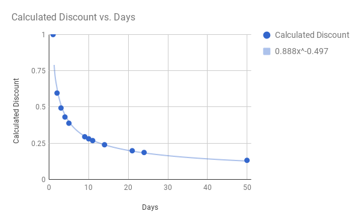
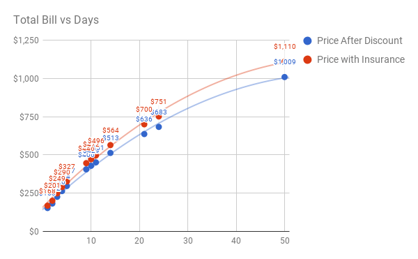

I am renting camera equipment for an upcoming trip, and I found the user journey to be kind of interesting. I will first detail my journey for renting the equipment, talk about challenges I had with the site, and then talk about how I came up with a pricing model that should enable a new UI design.

# Journey

1. Search around for equipment on the site.
2. Contact the shop (via email) to confirm the availability for the trip.
3. Discuss options back and forth via email.
4. Agree on equipment selection and visit site.
5. Search for equipment again and add them to the cart.
6. Each item needs to have the duration selected. Options include things like 2 Nights, Weekend, Weekend 1-Night, 1 Week, 10 Days, 2 Weeks, 3 Weeks, and 4 Weeks. There are double the number of options because for every selection there is one "with insurance."
7. At checkout, you specify the date range for pickup and drop off.
8. Input Credit Card, and complete the checkout process.

It is clear that the shop does not have a system for scheduling these pieces of equipment. The system is so ad-hoc and causes me to wonder if my equipment will for sure be available.

# Challenges

I started to think about some of my stumbling blocks along the way which leads me to what we can probably improve.

1. I have a particular date range in mind for my trip. I want to pay for what I use, but I can only select from the list the dates. I can either agree to overpay and trust them to reduce the charge or underpay and pay some difference at pickup.
2. I don't know what lenses are compatible with which cameras. As a result, the first body I picked wasn't compatible with the lenses I was planning to rent. The email conversation went well and resolved this pretty easily.

These two big components for me may not be an issue for others, but I think the first one will be fairly common. I chose to focus on that one.

# Design Process

> As a person looking to rent a camera I want to be able to input my pickup and drop off dates so that I can pay for the days I'm renting.

Before we can design a user flow where people rent based on pickup and drop off dates, we will need to design a method for pricing based on equipment rental price and days of rental.

\[caption id="attachment\_1891" align="alignright" width="150"\] Take a look if you are interested in seeing some of the work behind this post.\[/caption\]

I made an initial assumption that the owner of this rental shop has some method to the madness behind the existing pricing. I started by understanding how that pricing scales over time and then created an equation we can use to calculate the price.

 I created a table for the camera body I planned to rent using Google Sheets. Then, I benchmarked each "discounted" value compared to the 1-day rental. I came up with this chart, which then I used the trend to create a power series through the points.

\[caption id="attachment\_1841" align="alignnone" width="600"\] As the days increases the discount starts to flatten out. Not all of the points match perfectly, but this probably isn't significant.\[/caption\]

Then, I used the power series trend to create a new table with different values to show how the discounts would scale. I also added the other pieces of equipment and then tuned the equation to roughly match my rental total.

\[caption id="attachment\_1845" align="alignnone" width="600"\] With a few tweaks of the equation, I was able to come up with a curve that fits well to even a long duration such as 50 days.\[/caption\]

 After this, I went on to look into the insurance cost per day. It roughly looks like a 10% addition. This makes sense because the longer someone has the equipment the more chances there are for something to happen.

\[caption id="attachment\_1853" align="alignnone" width="600"\] We can see in this chart that the longer you rent the flatter the line gets. This prevents the cost of rental from becoming extremely high for people wanting to rent but not own. Without the discount equation, the equipment would cost over $1500 for a 10-day rental for reference.\[/caption\]

Now that we can easily calculate the cost of equipment based on the 1-day rental and the number of days we can create a new UI that will allow users to select their rental dates and see exactly how much they need to pay.
