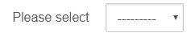

Sometimes you need to ask me for some information. Most of the time, I'm not really sure why you want it. My gender is an example of one input field that I'm never sure what people are doing with it. I understand that you could do something, but I don't think most people are.

One thing is for sure, this is probably the wrong way to ask for it.

We should always think about the information we would like to collect and the best method for collection.
