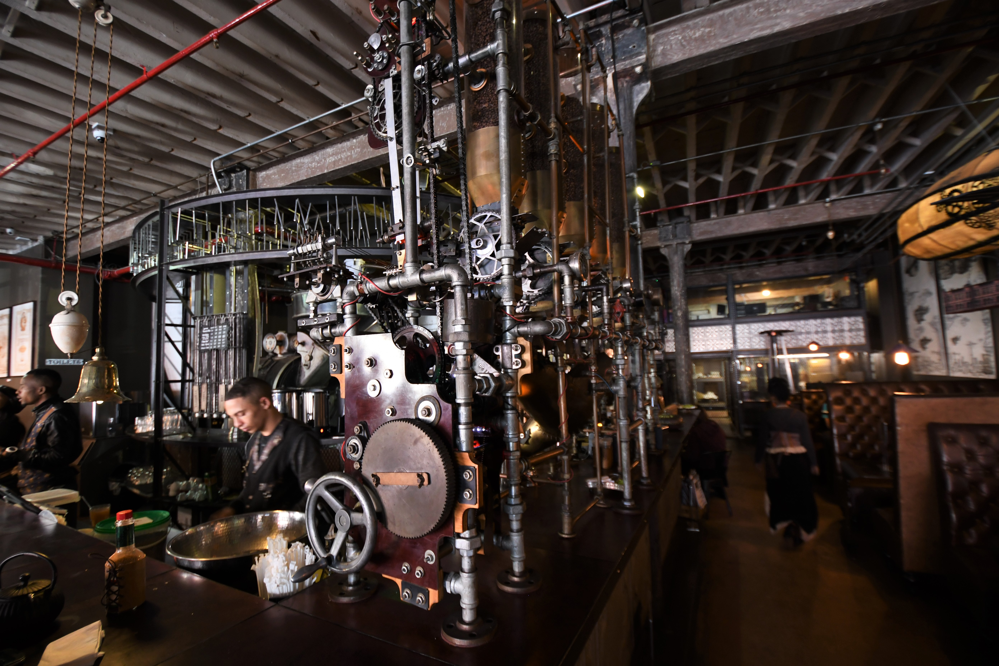
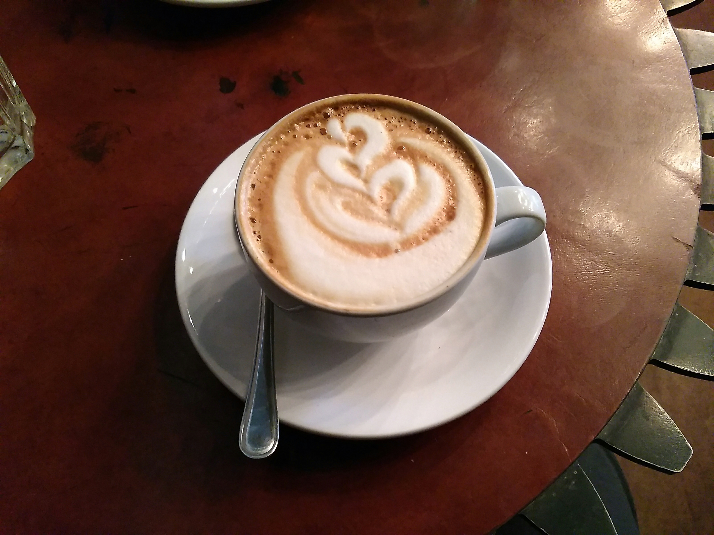
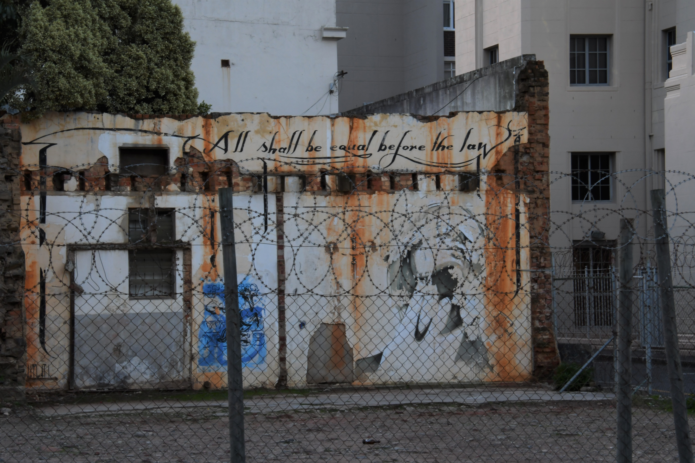
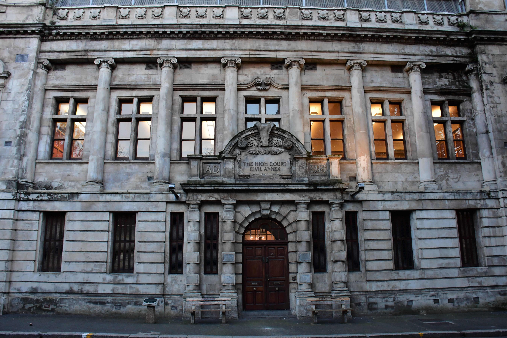

We went on a quick trip to South Africa recently, part of why I have been absent. We visited Cape Town, Table Mountain, Kirstenbosch Botanical Gardens, Cape of Good Hope, Hermanus (Whale Watching), and Kruger National Park (Safari).

The first stop is Cape Town is a beautiful city with an extraordinarily blue sky, even when there is rain. Here is a selection of photos from our trip. Over the next few weeks, I will reveal pictures from our trip.

Cape Town is home to [Truth Coffee Roasting](https://truth.coffee/), a steampunk-themed coffee shop with a delicious breakfast. See here their fantastic coffee dispensing machine!

The employees all dress up in steampunk attire. My family once attended (actually multiple times) a steampunk event at our local [Comicpalooza](https://www.comicpalooza.com/). At this event, the question was posed, "What is steampunk?" The panel and the room had much to say about the standard that defined steampunk, and at the end, we weren't really sure what was or was not steampunk. I may not know precisely what steampunk is, but this is it!

They make the most amazing Flat Whites my wife and I have ever tasted! We have been trying to find a rival! See the beautiful foam top of the flat white as it sits perched on the unique cog table.

We spent quite a bit of time at the V&A Waterfront, including the food market there. We had some delicious treats at this trendy locale. The entirety of Cape Town is surrounded by the stunning views of Table Mountain. Really, the mountain is a component of almost every major attraction in the city.

\[gallery ids="2128,2166" type="slideshow"\]

During our stroll through the city, we found The Company Garden. The gardens were filled with beautiful trees and flowers. These gardens served as a relaxing place to take a stroll.

\[gallery ids="2175,2176,2177" type="slideshow"\]

Apartheid lasted in Cape Town until 1994. There are remnants and messages sprinkled throughout the city. It is a reminder of how far we have come. "All shall be equal before the law" reads the writing on this wall.

In front of the High Court Civil Annex are two benches, one labeled WHITE ONLY and the other labeled NON-WHITE ONLY.

Until next time.
