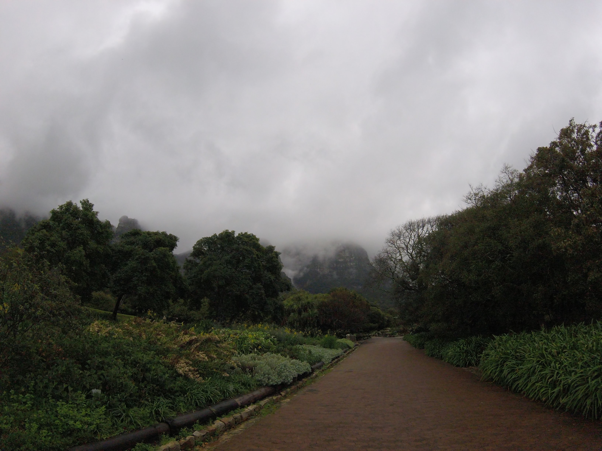
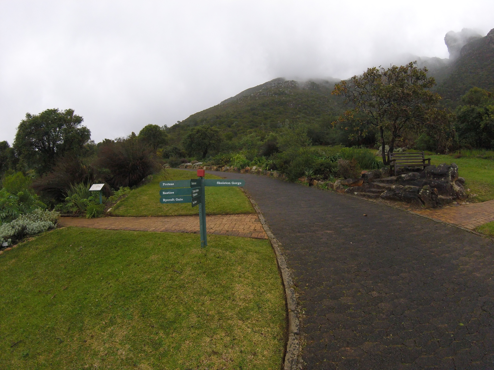
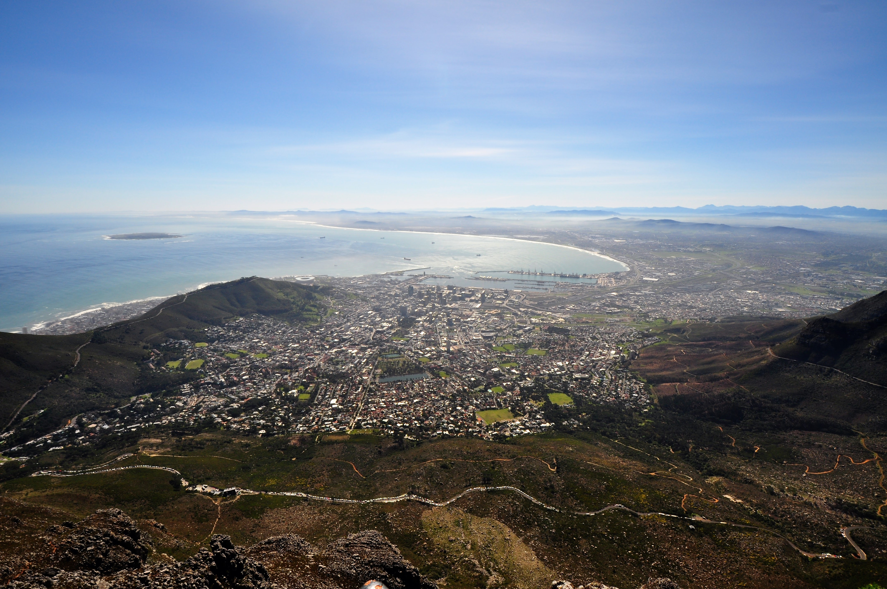

Our day at Kirstenbosch was a little gloomy at first. We actually were planning to visit Robben Island, but due to the weather were not able to get out to the island. We hopped on the bus and made our way over to these beautiful gardens.

After walking through the entrance, we were presented with some beautiful views of the clouds slowly raising up the sides of the mountains trapped in the crevices.

We continued to see the clouds as the backdrop for most of the morning. Everywhere we walked was another scene waiting to be revealed.

 

As we continued through the garden, we were presented with many beautiful flowers perfectly perched on the edge of the walkways. This photo was taken with our Go Pro since we left the regular cameras back at our hotel (due to the rain).

One of the major attractions of the gardens are the breathtaking views captured from their canopy walk. Here is a short video.

\[wpvideo ocCBEpif\]

We also had the opportunity to go up to the top of Table Mountain.  This is a shot of Cape Town from the top of Table Mountain. Robben Island is the island that is visible toward the left side of the photo.

One mysterious creature, of the many varieties available for viewing in South Africa, was the Dassie. Found at the top of Table Mountain, this animal's closest ancestor is the elephant. Its signature is the two sharp fangs on the front of its snout.

 

\[gallery ids="2195,2194" type="columns"\]

As we were on our way back to Cape Town, we snagged a photo of Lion's Head mountain from the bus.

