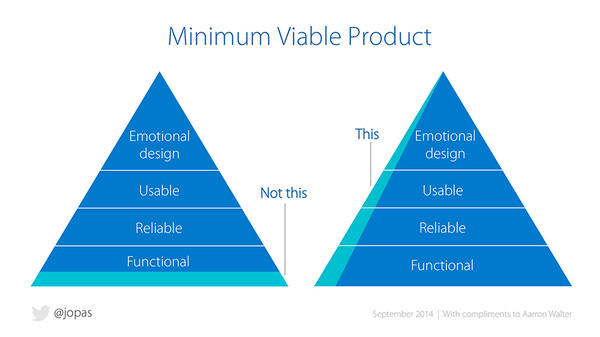
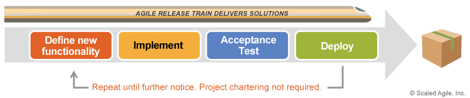

Lean UX to me is a method for prioritizing evaluative research over generative research. In the long run, you will have the same research information, but the product will have been delivered dozens of times to the customer already. It sounds like a great win on the surface, but it requires a large commitment on the part of the entire team.

The product owner (hopefully only one real person) needs to prioritize vertically to ensure full features are delivered.

 

\[caption id="" align="aligncenter" width="600"\] This diagram by [@jopas](https://twitter.com/jopas) showing how Minimum Viable Products (MVP) are created.\[/caption\]

 

Your dev-ops stable team (assuming this exists) is strong and has a knack and drive to automate deployments directly to your customer.

 

\[caption id="" align="alignnone" width="800"\] Diagram depicting the release train from the [Scaled Agile Framework (SAFe) website](http://www.scaledagileframework.com/agile-release-train/).\[/caption\]

 

Management understands that failure is learning. This new information can change the entire product direction, timeline, effort, and success!

> "I never **lose**. I either **win** or **learn**.

Your designers are OK with experimental designs that aren't tested or vetted. Sketchers welcome!

Want an overview of Lean UX? Check out [This article](https://www.interaction-design.org/literature/article/a-simple-introduction-to-lean-ux).
