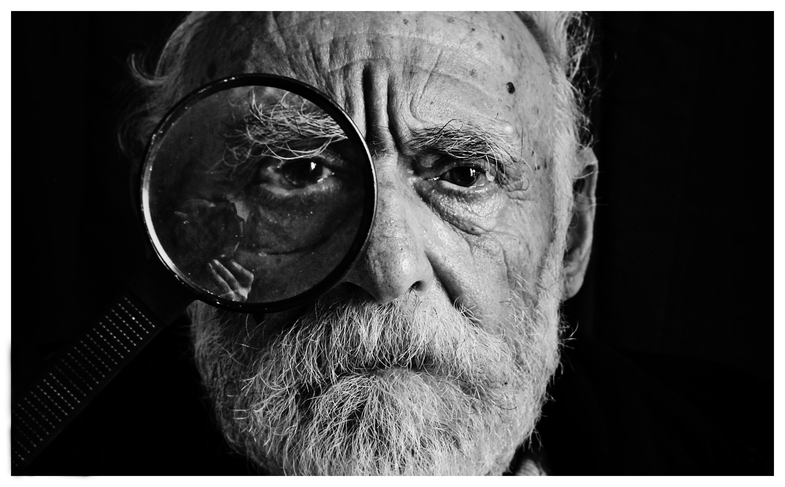

The easy thing to do for any product development is adding features. Sometimes the features we do implement are as important (if not more) than those we do not. To do this, we need a strategy and backing research to be able to say no to the superfluous and focus on the necessary. Research does not need to be a large effort, and you don't have to halt work to get it. Here are two strategies to get started.

 

\[caption id="attachment\_media-64" align="alignnone" width="4000"\] Focus on Basic Deliverables and get those things right! Photo by [Dustin Lee](https://unsplash.com/photos/jLwVAUtLOAQ?utm_source=unsplash&utm_medium=referral&utm_content=creditCopyText) on [Unsplash](https://unsplash.com/?utm_source=unsplash&utm_medium=referral&utm_content=creditCopyText)\[/caption\]

 

# Focus on basic deliverables

Identify and define the basic workflow and create the necessary components for your first version. Get this in front of your customer for testing, and then learn what is good or bad about it. Use this information to drive the future development. This method is all about reducing the gap between iterations and learning quickly.

 

\[caption id="attachment\_2447" align="alignnone" width="3556"\] Create touchpoint opportunities with your customers. Photo by [mari lezhava](https://unsplash.com/photos/q65bNe9fW-w?utm_source=unsplash&utm_medium=referral&utm_content=creditCopyText) on [Unsplash](https://unsplash.com/?utm_source=unsplash&utm_medium=referral&utm_content=creditCopyText)\[/caption\]

 

# Create touchpoint opportunities

Engineer ways for your teams to interact with customers regularly. Everyone on the team should understand the purpose, value, and usage of the products they create. Depending on what your product is for, usability testing and field studies can be great, low-cost ways to get started.
