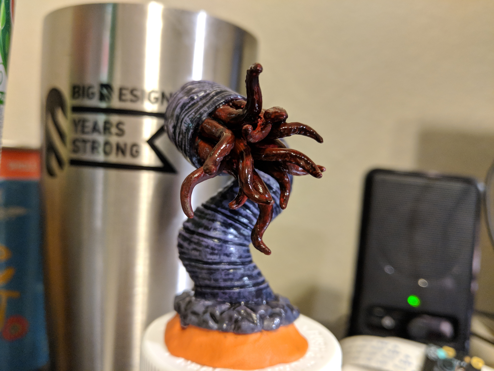

I took a great winter break. I have been having a ton of fun doing an assortment of things. It is only fair that I catch you up on some of the things I have been doing.

# Dungeons and Dragons

I started playing Dungeons and Dragons (5e for nerds) with a new group of folks in the Houston area late last year. Unfortunately, the character I created an painted died during our previous gaming session. The life of this character is probably not worth mentioning.

 

# Miniatures Painting

My friend Ron has gotten me started on model painting. It began with one miniature for my D&D game but has started to evolve into something... more. I am finding this activity to be quite fun and relaxing. It also turns out that some of my board games have pieces that need to be painted, like this one from Mansions of Madness.

 

\[caption id="attachment\_2480" align="alignnone" width="4032"\] [Chthonian](https://en.wikipedia.org/wiki/Chthonian_(Cthulhu_Mythos)) from my board game Mansions of Madness\[/caption\]
