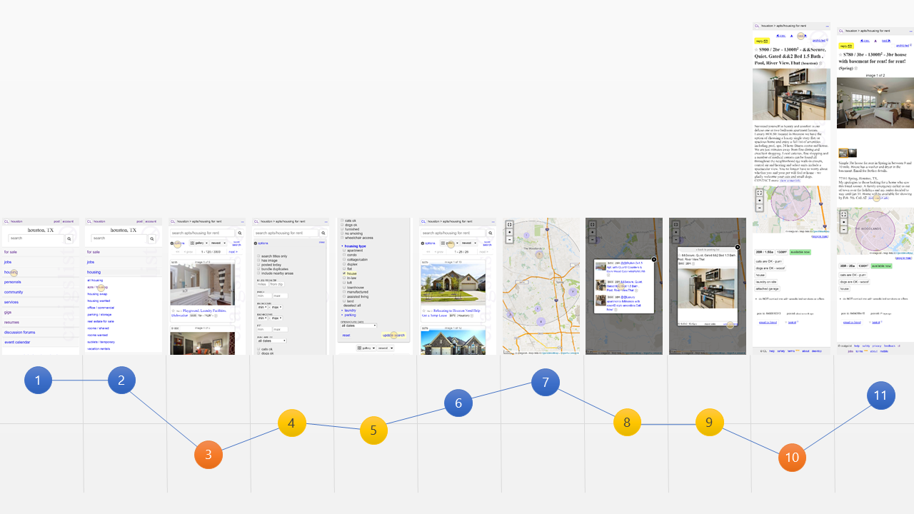

This is part two of my [Uplabs](http://www.uplabs.com/challenges) Craigslist redesign challenge. Last time, I reviewed several of the pages of the Craigslist Website and identified some stumbling blocks as well as positive components. Next, I will build up some artifacts that will help inform the design process.

With a site as large as Craigslist, one cannot jump into designing without a strategy and vision. We will need to lay out some personas, scenarios, and journeys. For this exercise, I will just make one of each.

# Persona

## Sam Searsher

Sam is about to graduate (23 years old) and start his first professional job in the Houston area (two weeks). Sam currently lives in Boston, and has only visited Houston for his interview and won't be able to make it there before he moves. The moving company needs to have the address by the end of this week or they can't initiate the move.

## **Goals**

- Find a rental house that will give him a home office so he can dabble with his computers.
- The rent should be $1000 or less. Sam has school loans that he wants to pay off quickly, so every dollar spent on rent is a dollar not spent paying down debt.
- He wants to have a 2-car garage so that he can have plenty of room for a car and his bicycles, so he doesn't have to worry about leaving cars out in the driveway or the street.

# Scenario

Sam will be performing this search at the coffee shop across the street from his college apartment. He has a few roommates that are moving out this week, and the internet is being shut off today. On top of everything that is going on, Sam's laptop stopped booting yesterday forcing him to do most of the searching using his phone. Sam is feeling a little concerned that he has waited too long to find an apartment. Sam buys a cup of coffee so he can sit down and focus on finding a rental home. He opens his phone and connects to the free Wifi.

He searches for Craigslist Houston and opens the website home page. He navigates to the section about apartments and housing. He uses the filtering options to narrow down the options to options relevant to his goals. He reviews several listings including photos of the property and checks the map to get a better understanding of how far his commute will be. He calls several listings before finding a property that was available and starts working with the property owner.

# Journey

Today, the journey looks like the following.

1. **Sam selects a category:** This experience is pretty straightforward for Sam, he quickly identifies that he needs to choose the housing option.
2. **Selects a subcategory:** He taps a second time to choose "apts/housing" without much hesitation.
3. **Too many options:** There are 3000 listings in this view. Each listing takes up most of his screen to see one option and it isn't clear where in town it is. After some fumbling around he finds the options.
4. **A sigh of relief, finally some filtering options:** He sees several options off the bat that he can change to assist his search. The interface is a little small for his fingers and results in a few options being erroneously selected, but he notices them quickly.
5. **Almost too many options:** He manages to find the housing type options which are a little difficult to work on his phone. To his surprise, there are options for parking in the options as well. He spends a few moments wondering how to save the options. At the top, of this gray space are two links for options and close. Neither of these seems to refresh the list, but his options are still there. He finally finds the update search button which clearly updates the list.
6. **Almost, but not quite:** The list is smaller than it was a moment ago, but it is hard to know where these options are located because they just say "Houston" or sometimes a street address. He decides to see what the other views are and remembers the map option would be handy for this.
7. **Much better:** The map shows the general locations of the properties and allows him to easily drill down to find options. He comes across one he is interested in.
8. **Ouch, so small:** A tiny window hovers over the map with even smaller pictures. In addition, the wording of the items is inconsistent which makes it difficult to determine what to look at. He finds one option and touches it to see more.
9. **Ugh, still so small:** The first option he picked allows him to see a little more of the photo but not much. He tries swiping to see if there are more pictures, but it does nothing. He isn't sure if there are more pictures or not. He clicks on more info, but that just shows text in the small window. He clicks view posting and finally moves on to a window with more options, but it opens in a new tab which is a little strange.
10. **Listing is underwhelming:** This posting has little details or information that would allow him to make a decision. He clicks the next option at the top of the listing and finds one that is a bit better.
11. **Making contact:** He decides to contact this property to see if he can get some additional information and negotiate the lease terms. He touches the option to reveal the contact information. It is a phone number, which means he will have to wait to continue his search for now.

Thanks for reading, come back next week to see the design.
