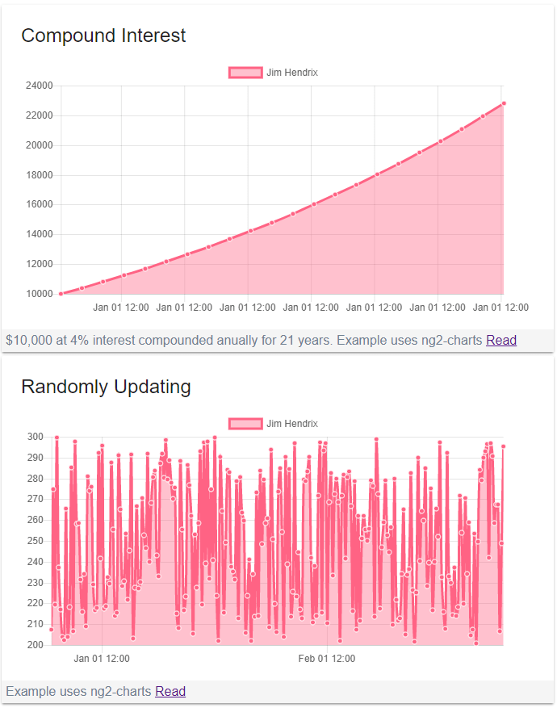

I have been learning Angular Material. I also wanted to play with some charts, so I'm using ng2-charts which is back-ended by chart.js. Since I have been designing more at work I can feel some of my programming experience getting rusty. Also, since I sometimes design using Angular Material components, I find it handy to understand how they all work together.

My primary goals for this experiment were to put together an Angular Material webpage that displayed some data on a few charts. Both charts use a service to supply the data, which right now is faked out in the service. The first is a simple static calculation of compound interest. The second is a randomly updating series which changes every five seconds.

\[caption id="attachment\_2491" align="alignnone" width="690"\] [See the examples live.](https://angularexperimentation.firebaseapp.com/) \*Note, these may not stay, because I will surely overwrite them at some point.\[/caption\]

Once I got these examples running locally I decided I would like to share them. I found a [straightforward article](https://medium.com/codingthesmartway-com-blog/hosting-angular-2-applications-on-firebase-f194688c978d) about publishing to [Google's Firebase](https://firebase.google.com/). Within fifteen minutes my examples were published. The other day, I did three releases.
