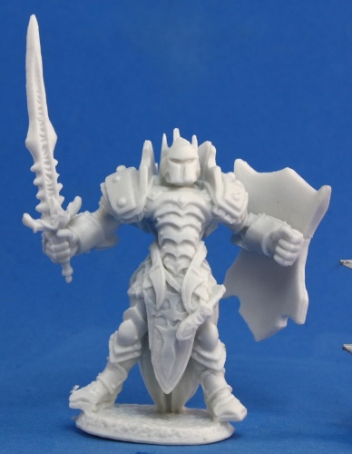
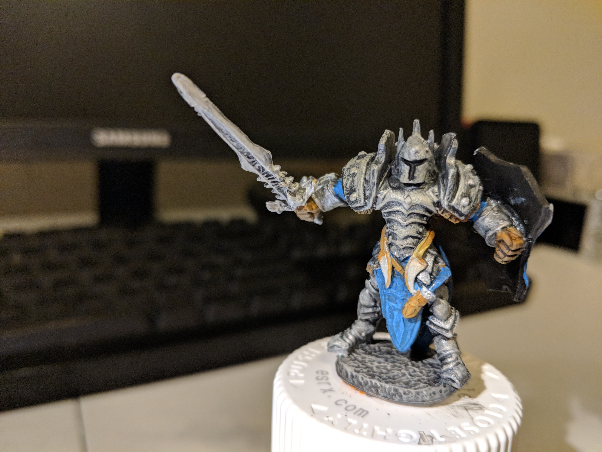
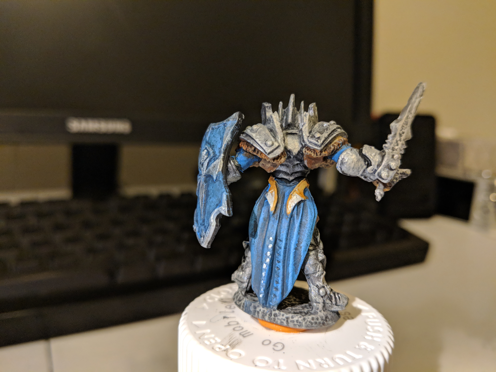

# The Plate Armor Knight - Completed
This plate armor knight came in a learn to paint kit from [Reaper](http://reapermini.com). Total paint time was somewhere in the 6-8 hour range.

Here is a picture of the unpainted model from the Reaper website. This model is from their Bones series of miniatures which are ready for painting.

\[caption id="attachment\_2488" align="aligncenter" width="388"\] [Mangu Timur - 77148](http://www.reapermini.com/OnlineStore/knight/sku-down/77148#detail/77148_w_1)\[/caption\]

Reaper has a few photos of different color schemes, but I followed the instructions in the box, which dictated a silvery-metal armor and blue accents.

Here are a few up-close details using a macro-lens attachment for my phone.

\[gallery ids="2496,2497,2498,2499" type="slideshow"\]
