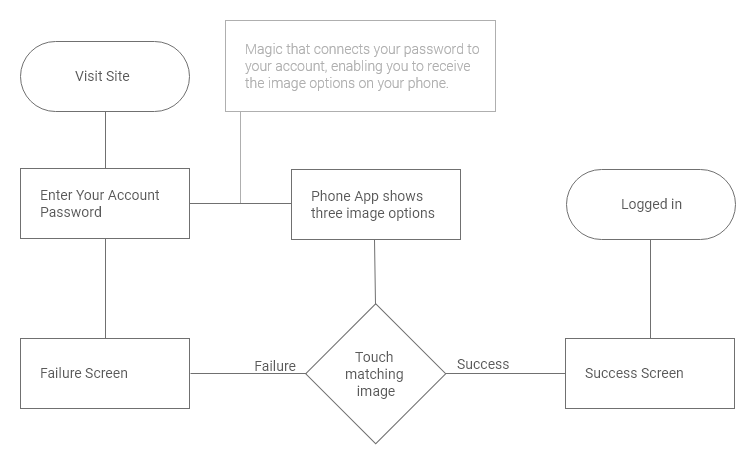
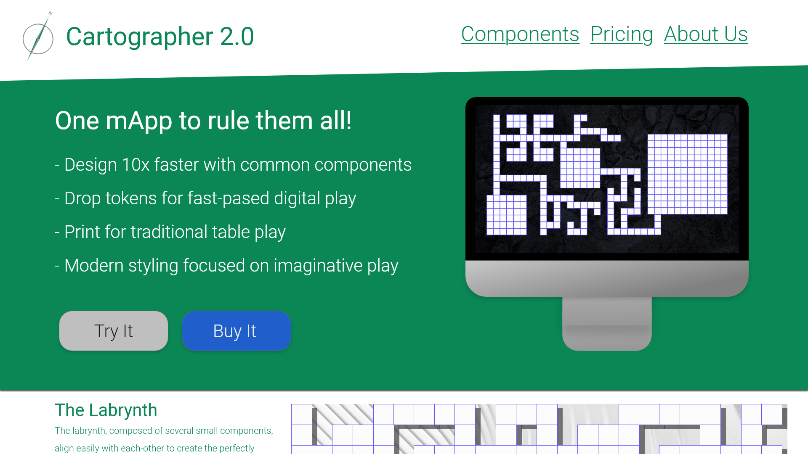
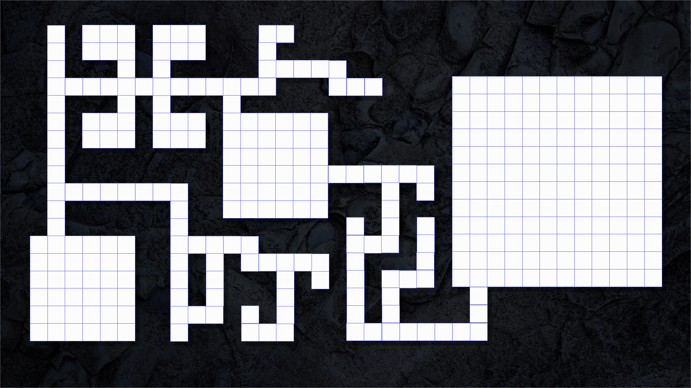
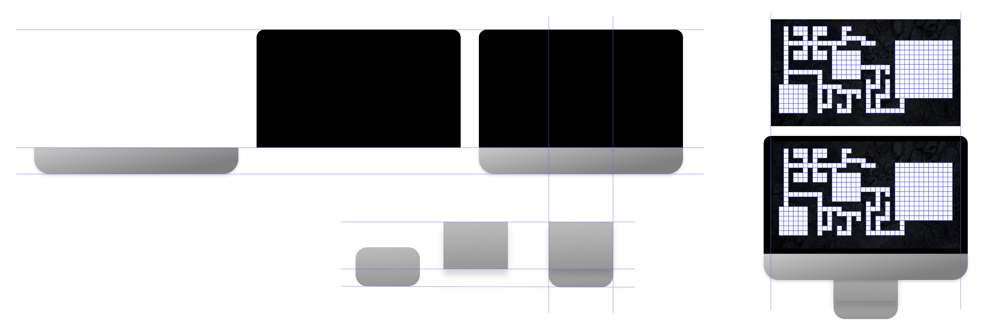
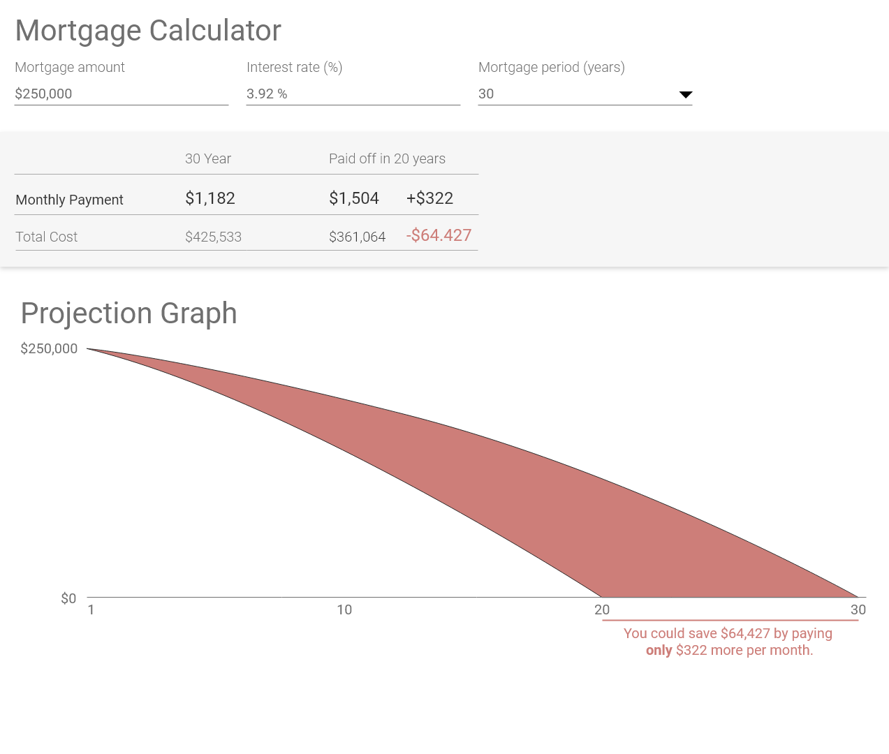
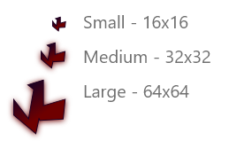

I have spent most of 2017 building my sketching skills. Recently, I have been wondering how far my designs could go if I started making higher-fidelity prototypes. Unfortunately, skill building can be hard on the go, so I signed up for the [100-day Daily UI challenge](http://dailyui.co).

I will be detailing the designs that I put together through my blog in bunches or as individuals depending on how much text I want to write with each one. I may exclude some of the 100.

So far, in Days 1-5, I have been able to action the challenge using Adobe XD. Rather than following my usual approach of sketching and then creating higher fidelity, I am jumping straight into XD. I have been using [Pexels](https://www.pexels.com/) for stock photos in my prototypes. 

# Day 001

Day one was targeted at a signup page, but I was so excited to begin that I read sign-in. So, this first prototype focuses on the sign-in process.

I decided to model the site after an old-fashioned speakeasy whereby the person interested in gaining entry has to provide a password. The text follows a conversational styling that I imagine a rough and tumble speakeasy might have had in the past. This speakeasy requires you to provide both a passcode and a matching image. See the simple flow with some magic between the password and image selection steps. This flow assumes you give the proper password but allows for success and failure of the image matching.

See the gallery below or pop open the interactive prototype, [click here](https://xd.adobe.com/view/63289d6b-34ee-402e-4bee-225119dc9e21-1519/).

 

\[gallery ids="2627,2626,2628,2625" type="slideshow"\]

# Day 002

Day two was targeted at a credit card filling page. I really despise filling out credit card forms, and with all of the recent data breaches, I find myself wanting to make more virtual cards for random sites. So rather than trying to make a better form, I decided to remove it altogether. I made an assumption that I would be on-the-go with my phone. The design is simple, once a credit card form comes up, a modal comes up on the screen requesting your fingerprint for a virtual card. Scan, generate, auto-fill, and purchase! For the design, I did use the standard Android/Material thumbprint icon.

# Day 003

On day three, I was challenged to create a landing page (above the fold). I have a vision in my mind about a cartography tool that makes maps quickly and easily. When I tried some of the software options on the market, I found that they focused on a level of detail that I feel is overkill for most games, and can cause the Dungeon Master to spend hours creating a single map. If I were going to develop a cartography application for Dungeon Masters, this is what the landing page might look like. I called it Cartographer 2.0, like Web 2.0.

Again this was created in Adobe XD, even the mockup Mac. Here is how I created the Mac. I started by creating the screen in XD. I used a background image from Pexels. Each square is its own shape since I couldn't figure out how to color with a grid. I'm sure it is possible.

Then, I moved on to creating the Mac display by arranging several shapes. As you can see, each component is individually shaped, styled, and positioned to provide the desired appearance. I then used XD to take the screen from above, resized, and dropped into place.

# Day 004

Day four asked for a calculator. Finally, something technical! One of the areas I spend free time thinking about is personal finance. Notably, the value of saving or paying extra on a mortgage. This calculator helps you quantify the benefit of an early payoff. The chart shows the payoff curve for the options selected, and an additional payoff curve shaving off 10 years. The value is quantified in a table, but then further enforced in the chart by coloring the waste in "[bacon fat](https://hexcolor.co/hex/cd7e79)."

# Day 005

Day five for me was a real challenge because visual design alone is a weak point for me. I typically prototype an icon for testing and then hand off to a third party because it is cheaper and comes out better looking. I took a stab at creating  JL logo for my site, and also updated the colors on the site to match the logo.

This concludes my first post about Daily UI challenges. Come back next week to see what else I designed.
