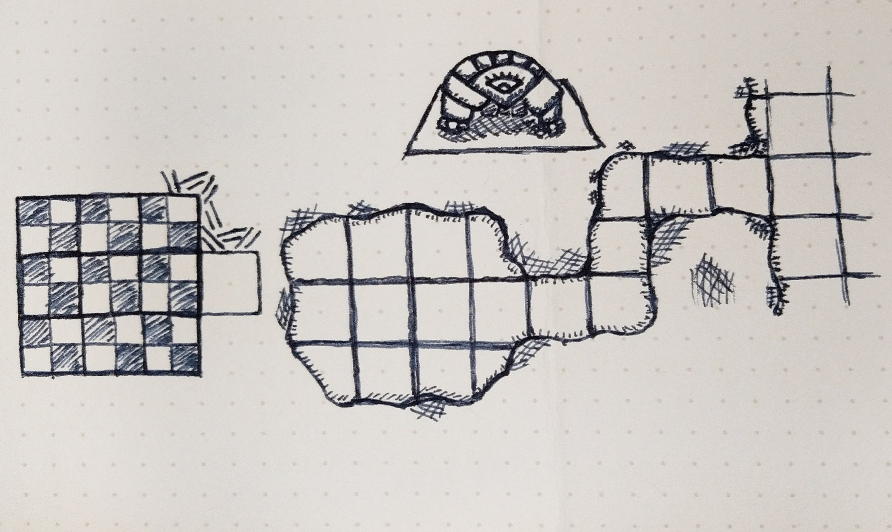

Recently, I have been enthralled with the work of [Dyson Logos](http://www.dysonlogos.com/). Over the last several weeks I have been watching as Dyson posted map after map of beautifully drawn maps. Being a fan of sketching, I was drawn naturally to the allure of gaming cartography. I had one problem, I just needed to sit down and make something.

Last Friday, I was a player in the Dungeons and Dragons (5e for those interested) game, so I didn't create the map. I took some photos of the table as we were nearing completion of the evening as well as drew a small sketch of the map near me on the table with some numbers so I could remember the story points. You can find my entire write-up including my final maps [here](https://sites.google.com/view/extant/home/612018).

\[gallery ids="2656,2657,2658" type="rectangular"\]

I did some research on [Dysonizing Dungeons](https://rpgcharacters.wordpress.com/2013/09/25/dysonize-your-dungeon/), and while I had been playing with my own versions of Dyson's [advanced style](https://rpgcharacters.wordpress.com/2013/09/28/advanced-dyson-dungeons/) with small sketches of maps, I decided to leave that for the future.

I started by sketching out each of the rooms, counting out each of the components to come close or match the original design of the dungeon as closely as possible. I did not realize how large the map was. It did not fit on my paper at all. I should have scrapped it as soon as I realized this, but I was more interested in getting a final product (just make a map already).

\[gallery ids="2662,2661" type="columns"\]

My second miscalculation was on the far-right side with the circular room. As I was working to line up the passages with the circular room, I forgot to leave them open resulting in a closed rounded room.

I think that by comparison, this is clearly a noob's map, and the "cheat" style looks far inferior to the fully-fledged Dysonified maps. Overall, the experience was rewarding, and drawing all of those lines was quite relaxing.

I can't wait 'till the next map I draw. Next time, I will plan my attack better and amp up the styling.
