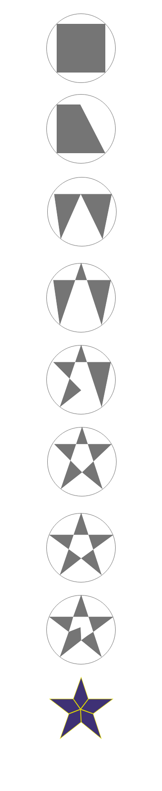

# Daily UI Challenge 9
The Daily challenges aren't as much daily as... maybe weekly. I hit a stumbling block on Challenge 7, which cost me some time. I just couldn't for the life of me think of something I cared about to spend the time on "settings". So, I shelved that one and have moved on for now.

Color selection isn't really my thing, so I tried to use Paletton to create an interesting palette. [View the palette here](http://www.paletton.com/palette.php?uid=74b0u0kllll3oeKcni2ujoDQRrW). I wanted to design an app for playing music in the car. I tried to use large readable fonts and enormous touch areas. I moved most of the fidgety buttons from most players to a menu.

The interesting shape of the day is the favorite star. In XD, I started with a square inscribed inside of a rectangle. Added a point to the top middle for the top point of the star. Then, I inverted the four corners. Some small adjustment makes the primary star shape. Next, I added three points to each side of the interior pentagon, two of the points for each corner of the pentagon and one to bring to the center to form the final star points shape.

This design has quite a bit of interactivity in the prototype so have fun switching songs and checking out the settings pane [in the cloud](https://xd.adobe.com/view/68912ab3-21a3-4e52-59f5-c303eb96f2e8-1ea0/).
