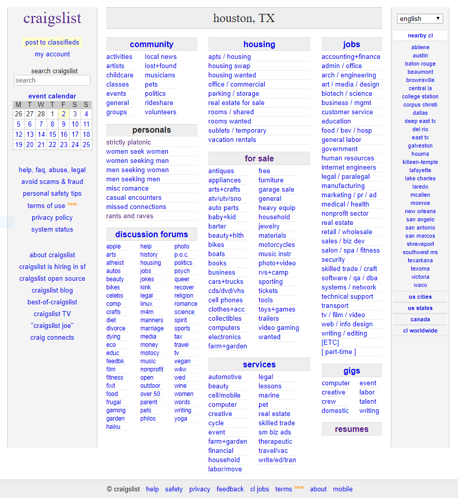

I decided to participate in the [Uplabs](http://www.uplabs.com/challenges) Craigslist challenge. In short, they are looking for Craigslist redesigns as if Craigslist were released today. I find this particular challenge interesting because I think the design is simple and straightforward like old-timey newspaper postings. Doing anything that gets in the way of the ease of operation is a failure case. Another challenge that Craigslist has is that none of the content is managed by Craigslist, leaving the content unedited by a professional. This post will be a 3-part series leading to the final result.

# Analysis

TLDR; Overall the site is functional. Across desktop and mobile, it remains clean and maintains the same hierarchy. The products can be organized to an individuals preference easily and rapidly. Something incentivizes posters to encode information in the title of the posting. This can cause some readability challenges as everyone tries to cram in as much content as possible.

\[caption id="attachment\_2501" align="alignnone" width="893"\] Screenshot of Craigslist as of today. You can see all of the categories and sub-categories that the site has to offer in the middle. There are some lesser-obvious features on the left-hand side of the screen.\[/caption\]

 

\[caption id="attachment\_2504" align="alignnone" width="688"\] Unfortunately, as seen in this screenshot of a smaller desktop window, the interface is not very responsive.\[/caption\]

It wouldn't be a good redesign without looking at how things work on mobile. Below are two screenshots of the mobile version of the site. You can see that the high-level categories from the traditional desktop site are prominently displayed with a search bar. Touching a heading expands quickly to reveal the sub-categories. In order to see all of the gigs, you then have to touch the smaller "all gigs" option. Effectively, the functionality that is primary remains functional.

 

\[gallery ids="2502,2503" type="rectangular"\]

The listings are organized logically and are easy to scan depending on your preference. It is possible to switch between three modes, Thumb, Gallery, and Map view. The map view for this category is pushed pretty strongly in the thumb and gallery mode, but it gets in the way on the gallery view.  Not all listings have this pushy map view tile.

\[gallery ids="2505,2506,2507" type="slideshow"\]

After looking through the listings for a while I started to notice that there are some interesting things going on with the text in the listings. What was once a simple layout on the homepage turns messy and dirty because people are encoding information about the posting in the title. This is a common practice that I have found even in the oil and gas space, names of files or objects in an application that can be measured on the screen in inches. It is a tough problem to solve because you first need to understand what people are trying to accomplish with the naming convention and find a way to enable them to do it in a better way.

\[caption id="attachment\_2508" align="aligncenter" width="315"\] The encoding of information in the title of a post makes it harder to filter and sort on this information.\[/caption\]

Once in the posting, there is plenty of room for multiple photos and a solid description as well as some metadata tags. Navigation allows you to go to the next and previous postings as well as back up to the listings page.

\[caption id="attachment\_2509" align="aligncenter" width="1248"\] This posting has plenty of photos and a long description of what is available. Interestingly, this particular post leaves off details that many people would find valuable such as the square footage.\[/caption\]

As I expected, there is a lot going on in the creation interface for a rental. The form is all over the place. The content is poorly grouped into overly generic segments and the standard metadata is not part of the main content area.

\[caption id="attachment\_2511" align="alignnone" width="2644"\] This form for creating a listing incentivizes people to encode information that is available in the form.\[/caption\]

I think this gives me enough material to move forward to a Journey Map and then a design. Check back next week to see how I break down a single journey to create a design.
