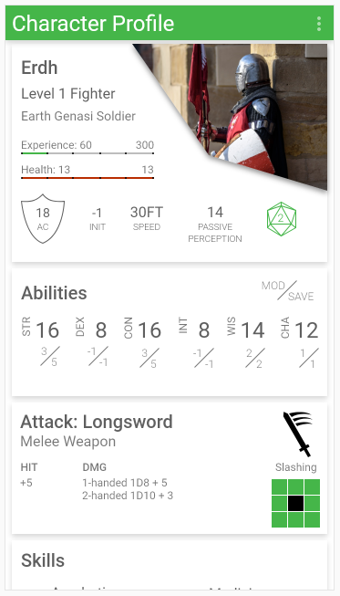

Initially, I felt a bit bored by Challenge 6. Once I started thinking about what I wanted to design, though, I remembered that I have a DND 5th Edition Campaign full of characters. Each character could have their own "user" profile. For those who are unfamiliar, characters in DND have all kinds of information you can track, including background information, stats for their capabilities, items they are holding, and more. This information is typically captured in a character sheet (example below).

This sheet is then used during play. I decided that it would be nice to this information on my phone. I used inspiration from DND Beyond to come up with what I should display.

I typed all of the components into the prototype and rearranged them into sections that I thought could be useful. In my imagination, I could use the menu options to turn on-and-off different sections as well as rearrange them. I used Pexels to find the character image. Interact with the prototype through [Creative Cloud](https://xd.adobe.com/view/faa954c6-67b0-409b-70dd-da4ed0feae07-8c98/).

# 20-Sided Die Design

The die in the profile represents the inspiration for the character. When a character is "inspired", they are able to use that inspiration for advantage (rolling two 20-sided dice and taking the higher value). I originally created the 20-sided die in Illustrator and copied the paths over, but it is easy to re-create in XD once you understand how to decouple the parts. I used an image online to understand the perspective of a 20-sided die. The first two steps are the hardest because XD doesn't provide shapes beyond circle and rectangle.

## Step 1:

First, you need to create a hexagon. Draw a rectangle that is a little taller than wide. Segment into three parts vertically with more space in the center (I used a line for this). Edit the path and add new points along the sides corresponding to those points. Now, add two additional points in the center on the top and bottom. Now remove the original four corners. Use the same technique to accomplish the creation of the triangle.

## Step 2:

Position the triangle above the half-point and a little off to one side. Then, use lines to connect the triangle corners to the corners of the hexagon.

## Step 3:

Finally, add the number.

