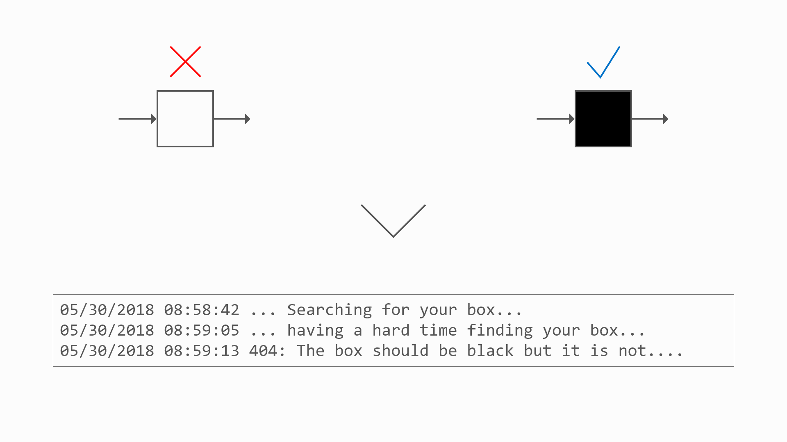

Challenge number eight was to design a 404 screen. The screen I created could be used for something fun and coder-centric. In software development, I always refer to the black box as anything I want to abstract away. In this case, the black box is the page.

I included some faux messages coming from a log down at the bottom to play up the search for the box and arranged the shapes in relationship to each other to form a screen that is a bit anthropomorphic in nature.

