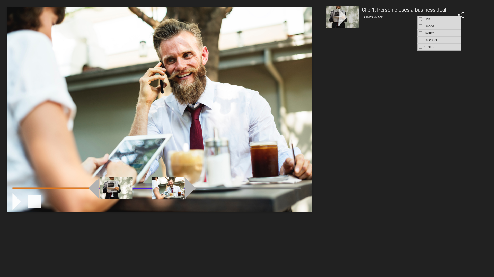

Design challenge 10 is one that barely held my interest. I spend most of my usual design time working on scientific applications (no social sharing here). It took me a while to really think of something worth sharing, and then it came to me.

What if I created a tool for creating clips from videos and enabled those to be shared through links, embeds, and other social media platforms. This simple mockup shows roughly (really) how one might make a clip and share it.

 

From a technical perspective, the clip could be a derivative of the original video. This means that an infinite number of clips could be stored because you wouldn't have to store the data for the clips separately.

Additionally, watching a clip would link back to the original video enabling you to view the full video.
