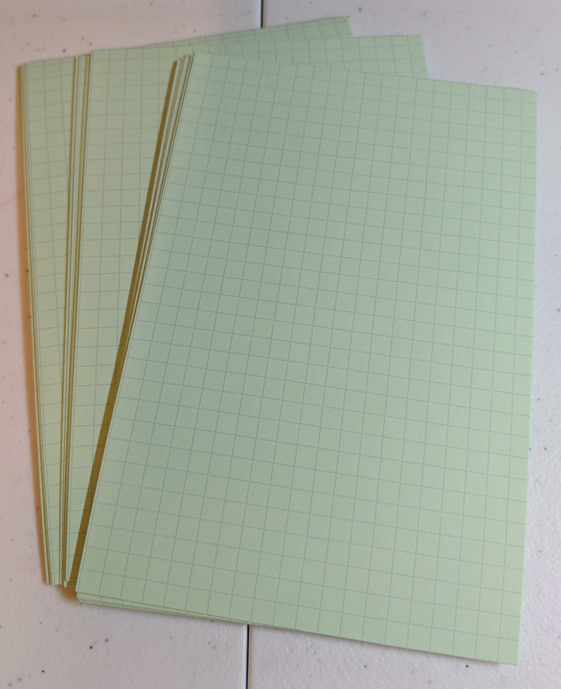
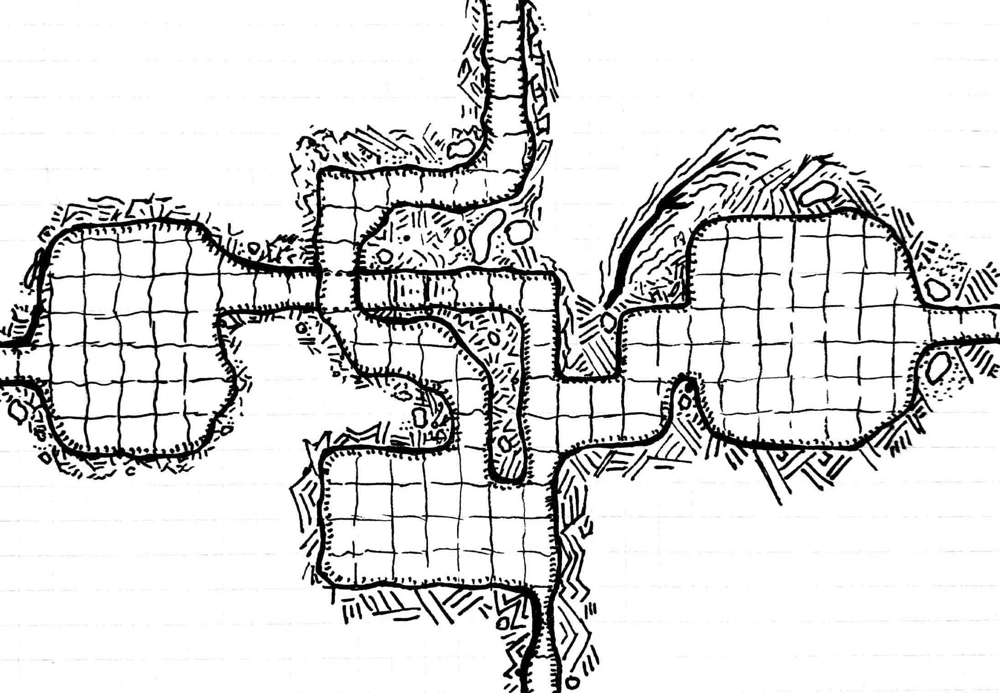

This may turn into a series, but I wanted to show off something early. Inspired by [Dyson Logos Geomorph Challenge](https://rpgcharacters.wordpress.com/maps/geomorph-mapping-project/), I decided to buy some grid cards online and create some interlocking maps.

The goal will be to have cards that can interlock in different spaces on each side of the card. This map is two levels with three exits for one and one for the other. Some of the detailing I have used in the gaps are inspired by Dyson's tutorials, but some areas I have added some flair from the geoscience domain of sketching that I have seen to depict layers of the earth. I'm still coming up with my own style for this part of my maps.

I pulled out my old scanner, but it doesn't seem to be working correctly. I ended up using my phone and [CamScanner](http://www.camscanner.com/r?398426282) to scan the map in and set it to black and white. _If you use the link to get set up with CamScanner, I will get a referral bonus of 100MB storage._
