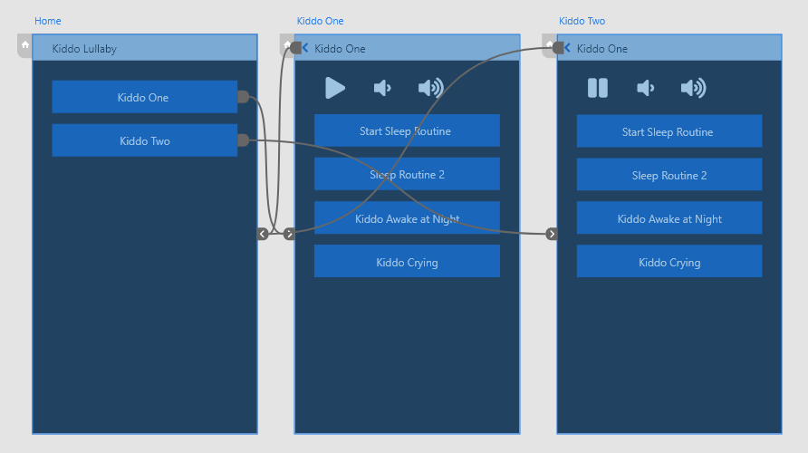
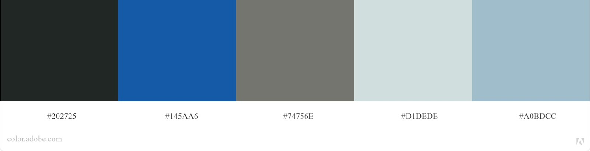
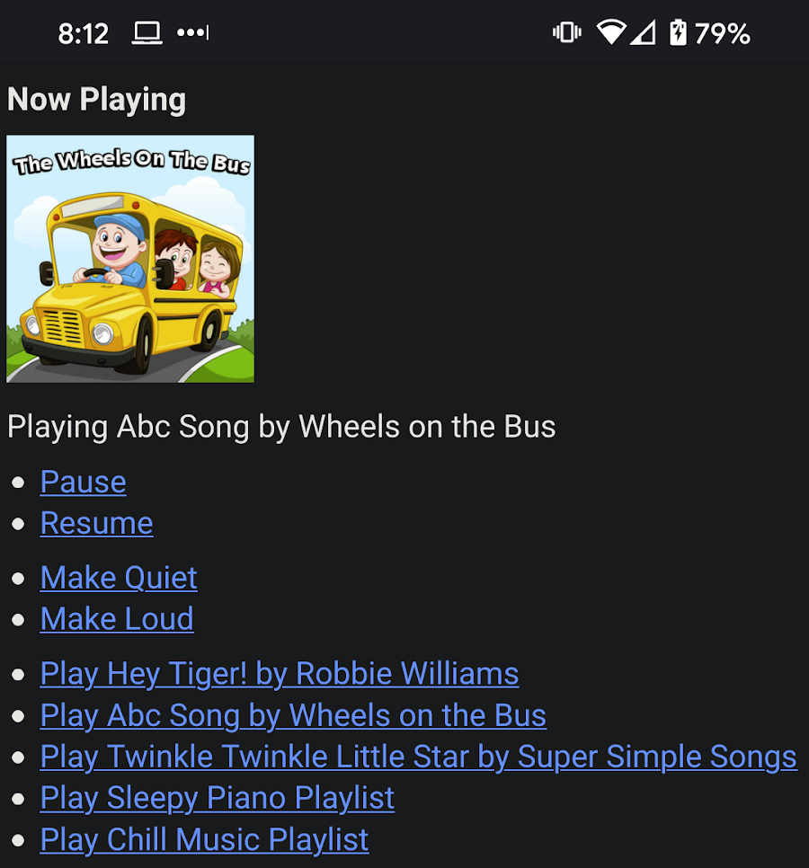
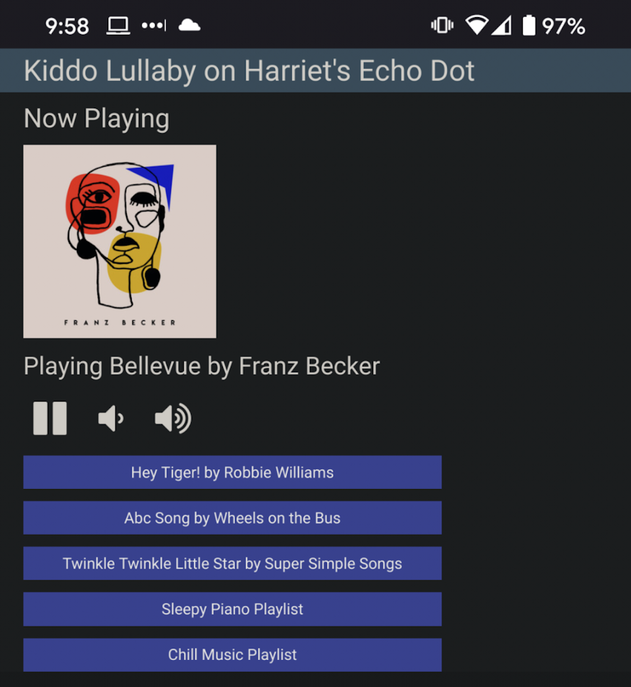

# Kiddo Lullaby

This will help grandparents manage music in the kid's rooms specifically targeted at nap time. This includes triggering specific playlists or songs and changing the volume.

## Persona

**Grandma Phyllis**

Grew up without all these bits of technology that we have integrated int our young one's routines. As a result, watching the kiddos can be a little intimidating.

* Uses an iPhone on a day-to-day basis for calls, social media, games, and texting
* Uses an Echo Show for calling family, and ocassionally for playing music
* Unfamiliar with controlling the Echo remotely
* Unfamiliar with the complex setup required between Spotify and Echo devices

# Design

The design below shows a basic flow through the MVP. Someone with some development experience will be required to set up this system for each of the rooms, this design is intended to help parents and grandparents control music in the kids' rooms. 

Since this app it likely to be used in a dark room, I chose a dark theme. This theme was built using Adobe color using the colors of my car steering wheel and the Subaru Logo. 

# Progress

Within 24 hours of coneptualization I had a working prototype up and running. The prorotype initially started out with a Node library for controlling Spotify, but I quickly found that there was a Python library that was easier to work with. I discovered during my initial testing that it was easy to pull the album art of what was actively playing, so I added that additional feature so that whoever is controlling the app can see if something is active.

My first round of testing with my spouse made me realize quickly that I had forgotten a pause option. I was able to use lean development to add that option quickly.

Additionally, we only need one of these working to begin with, so I decided to make sure we had one of these working properly before moving on. 

In just a few short days the application achieved stability and has been in use. Updates to the app can be deployed to my homeserver quickly using Docker.

Want to work together? [LinkedIN](https://www.linkedin.com/in/joshualowry/)